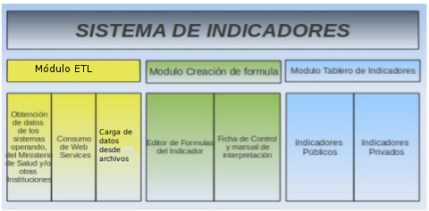

# Antecedentes
## Problemática
En la actualidad hay muchos sistemas (transaccionales) que registran los datos de los servicios de salud y de los recursos utilizados para la entrega de estos servicios, pero, no existen herramientas que pueda convertir todos estos datos en información para la toma de decisiones, por lo que es necesario crea una aplicación que interactúe con los diferentes sistemas de tal forma que combine datos y genere indicadores que sean de utilidad para la toma de decisiones y agilice la gestión de la Institución e informen a la población de la situación de la salud.

La siguiente figura representa la situación actual de los sistema en la cual tenemos dos actores principales, por un lado los sistemas y las bases de datos y por otro los usuario que registran datos de las
actividades y recursos utilizados en los servicios de salud, todo esto utilizando en la gran mayoría la red de Internet.

## Componentes
El sistema contará con tres módulos:

* Módulo de extración, transformación y carga de datos (ETL por sus siglas en inglés): Permitirá la conexión a los diferentes orígenes de datos: Bases de datos, hojas de cálculo(Excel y OpenOffice/LibreOffice) y archivos de texto en formato CSV. En este módulo se registrarán los parámetros necesario para poder realizar la conexión y extracción de los datos necesarios que se utilizarán para el cálculo del indicador respectivo. En esta parte se trabajará sobre los datos obtenidos a patir de las informaciones cuantificables válidas, relevantes y oportunas producidas por los varios sistemas nacionales y estatales de información de salud. La información disponible y accesible, permitirá una mejor coordinación y operación de la salud desde el MINSAL hacia otros organismos que requieran dicha información.

* Módulo de Ficha Técnica del indicador, en este módulo se establecerán las variables y fórmula para el cálculo del indicador, también se registrará la información necesaria para la interpretación del indicador.

* Módulo de tablero de Indicadores, en este módulo se mostrarán todas las alternativas de indicadores disponibles, presentación, y los diversos parámetros para poderla personalizar. Propone proveer información y datos presentando éstos de una manera accesible y objetiva, utilizando visualizaciones gráficas.

Además de los módulos antes indicados contarán con sus respectivas interfaces de identificación, registro y auditoría.
Como podemos observar la siguiente figura representa las nuevos elementos a incorporar a los sistemas de información como son los datos de otras fuentes (Bases de datos de otras instituciones, archivos de hojas de cálculo y archivos de texto CSV), también otro elemento de gran importancia es el acceso de la población a toda esta información. Así como poder brindar información a otros sistemas de nivel regional.

En el siguiente esquema se representan los diferentes módulos propuestos.

