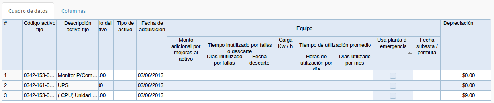
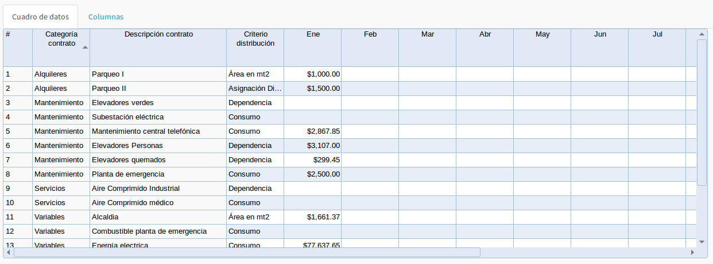

# Módulo de costos: Manual de usuario final
##Introducción
El análisis de los costos constituye una herramienta fundamental para los tomadores de decisiones de las Instituciones Prestadoras de Servicios de Salud. Es importante que estas instituciones puedan llegar a construir estructuras de análisis de costos para la gerencia estratégica de los costos y gastos.

La gerencia estratégica es un sistema de gestión que busca fortalecer el desarrollo organizacional mediante un manejo apropiado de los costos; éstos se convierten en una herramienta básica para lograr la eficiencia.

Los actuales sistemas de salud y los elementos de la gestión de los servicios de salud orientados a la eficiencia con calidad requieren metodologías y herramientas que den respuesta a las necesidades de los gerentes de servicios y entidades prestadoras de servicios de salud.

El Ministerio de Salud de El Salvador posee los recursos de infraestructura y sistemas de información que sirven de insumos para la medición de la eficiencia en los servicios de salud. Sin embargo, para ello es importante la construcción de un subsistema de mediación qué permita canalizar toda esta información de una manera práctica y amigable a los tomadores de decisiones de la red de servicios.

## Mano de obra
Todo elemento asociado directamente a la mano de obra, empleados, contratistas o cualquier modalidad contractual existente se considera para análisis. Tiene tres elementos fundamentales: los salarios como asignación básica, honorarios como pagos totales por actividades o acciones específicas y prestaciones sociales como los elementos adicionales a las asignaciones básicas de acuerdo a las formas de contrato específicos o derechos laborales adquiridos por los empleados.

Las secciones siguientes describen los formularios utilizados para la captura de los datos de mano de obra.

### Valor pagado
En el menú principal **Costos** se encuentra la opción **RRHH::Valor pagado**. Varios de los datos requeridos se cargarán a partir del origen de datos del Sistema de Recursos Humanos existente en la Institución, la cantidad de datos que serán necesarios ingresar dependerán de lo que se proporcione por el sistema de Recursos Humanos existente, pudiendo variar de una institución a otra.

Como primer paso debe ingresar los parámetros de búsqueda: Mes y año, Establecimiento, y de manera opcional la dependencia de la cual se ingresarán los datos de recursos humanos.

Luego al dar clic en el botón **Cargar** se recuperará información y será necesario completar la que haga falta

Se cuenta con dos pestañas: **Cuadro de datos** y **Columnas**; la primera contiene la cuadrícula para ingresar los datos del recurso humano y la segunda permite ocultar/mostrar columnas de la cuadrícula.

Aunque las columnas podrían variar según la implementaicón de cada institución, entre ellas podemos encontrar:
- Dependencia, unidad donde está destacado el recurso humano.
- NIT, Número de identificación tributaria.
- Nombre del empleado: Nombre y apellidos del empleado.
- Partidad y subpartida presupuestaria: Datos según acuerdo o contrato de nombramiento.
- Tipo de empleado: Entre algunos podemos encontrar: 
	- Auxiliar de enfermería
	- Enfermera
	- Médico
	- Otros profesionales
	- Practicantes internos
	- Residentes
	- Servicios Generales
	- Técnico administrativo

- Especialidad: Por ejemplo Cardiología, Anestesiología, entre otras.
- Forma de contratación: Adhonorem, Contrato GOES, Fondos propios, Ley de Salarios, Proyectos, entre otras.
- Es de servicio social: Marque si el recurso está en proceso de Servicio Social o de incorporación
- Recurso no genera costo de aportes patronales: Marque si el recurso está contratado sin generar costos de Aportes Patronales. Por ejemplo personal contratado por Servicios Profesionales.
- Cantidad de dependencias donde labora: Colocar el número de dependencias donde el recurso desempeña sus actividades; en caso de no compartir el recurso se dejará en blanco. Ejemplo: Una secretaría clínica, un jefe o supervisora que tiene a cargo el apoyo en 2 servicios/dependencias
- Horas contratadas por día
- Salario individual
- Fondo de protección: Puede ser: AFP, INPEP o IPSFA
- Descuentos aplicados en el mes
- Horas trabajadas en el mes
- Otras prestaciones: Registrar total de las prestaciones asignadas: Aguinaldos, bonificaciones y otros.
- Horas NO trabajadas **con** goce de salario
- Horas NO trabajadas **sin** goce de salario

### Distribución de horas
En el menú principal **Costos** se encuentra la opción **RRHH::Distribución de horas**. En este formulario registrará la distribución de horas por actividad/Unidad Productiva (Consulta, Hospitalización, Interconsultas, Procedimientos, entre otras).

### Costo de mano de obra
En el menú principal **Costos** se encuentra la opción **RRHH::Costos**. Esta cuadrícula mostrará el resultado de los costos del recurso humano

La forma en que se han calculado los costos es según el siguiente algoritmo

~~~~~~~~~~~~~~~~~~~~~
// Declaración de constantes 
limite_isss = 685.71;
isss_porc_patronal = 0.075;
limite_ipsfa  = 2449.05;
ipsfa_porc_patronal = 0.06;
afp_porc_patronal = 0.0675;
limite_afp = 5467.52;

INICIO
	IF tipo_fondo_proteccion = 'AFP' THEN
        porc_fondo_proteccion = afp_porc_patronal;
        limit_fondo_proteccion = limite_afp;
    ELSEIF tipo_fondo_proteccion = 'IPSFA' THEN
        porc_fondo_proteccion = ipsfa_porc_patronal;
        limit_fondo_proteccion = limite_ipsfa;
    END IF;

    IF (salario > limit_fondo_proteccion) THEN
        fondo_proteccion = limit_fondo_proteccion * porc_fondo_proteccion;
    ELSE
        fondo_proteccion = salario * porc_fondo_proteccion;
    END IF;

    IF (salario > limite_isss) THEN
        isss_patronal = limite_isss * isss_porc_patronal;
    ELSE
        isss_patronal = salario * isss_porc_patronal;
    END IF;

    IF (forma_contrato <> 'AD' AND forma_contrato <> 'LS' AND forma_contrato <> 'CG' AND no_genera_costos_patronales = 'true' ) THEN
        fondo_proteccion = 0;
        isss_patronal = 0;
    END IF;

    IF horas_trabajadas_mes > 0 THEN
        IF dependencias_donde_labora >= 2 THEN
            costo_con_aporte_y_aguinaldo = isss_patronal + fondo_proteccion + (salario - ((salario / horas_trabajadas_mes) * horas_no_trab_SG) + aguinaldo) / dependencias_donde_labora;
        ELSE
            costo_con_aporte_y_aguinaldo = salario - (( salario / horas_trabajadas_mes) * horas_no_trab_SG) + isss_patronal + fondo_proteccion +  aguinaldo;
        END IF;
        costo_hora_con_aporte_y_aguinaldo = costo_con_aporte_y_aguinaldo / (horas_trabajadas_mes - horas_no_trab_CG) ;
    ELSE
        costo_con_aporte_y_aguinaldo = 0;
        costo_hora_con_aporte_y_aguinaldo = 0;
    END IF;

    IF horas_trabajadas_mes = horas_no_trab_CG  THEN
        costo_hora_no_trab_CG =  costo_hora_con_aporte_y_aguinaldo;
    ELSE
        costo_hora_no_trab_CG = horas_no_trab_CG * costo_hora_con_aporte_y_aguinaldo;
    END IF;

    IF (horas_trabajadas_mes = horas_no_trab_SG)  OR horas_trabajadas_mes = 0 THEN
        costo_hora_no_trab_SG =  0;
    ELSE
        costo_hora_no_trab_SG = horas_no_trab_SG * (salario / horas_trabajadas_mes);
    END IF;

    salario_descuentos_permisos = costo_con_aporte_y_aguinaldo - descuentos;

    IF horas_trabajadas_mes = horas_no_trab_CG THEN
        costo_hora_descuentos_permisos = salario_descuentos_permisos;
    ELSEIF horas_trabajadas_mes > 0 THEN
        costo_hora_descuentos_permisos = salario_descuentos_permisos / (horas_trabajadas_mes - horas_no_trab_CG);
    ELSE
        costo_hora_descuentos_permisos = 0;
    END IF;
~~~~~~~~~~~~~~~~~~~~~

## Gastos Administrativos

Se consideran como gastos generales o gastos administrativos a los elementos del gasto asociados a un servicio y con relación a los elementos de apoyo o administración necesarios para mantener el servicio funcional, como son los servicios públicos, la vigilancia, los seguros, etc. Estos gastos también deben ser distribuidos a todos los centros de costos de la manera más específica posible.
La lista de los gastos generales puede ser tan amplia como la normatividad existente en cada región lo requiere,  algunos elementos comunes son:
- Seguros generales
- Servicios públicos
- Impresos y publicaciones
   - Publicidad y propaganda
   - Impresos, publicaciones, suscripciones y afiliaciones
   - Fotocopias
- Materiales y suministros
   - Loza y cristalería
   - Elementos de aseo, lavandería y cafetería
   - Equipo de seguridad industrial
- Impuestos, contribuciones y tasas
- Mantenimiento y repuestos
- Gastos financieros
   - Procesamiento de información
   - Gastos por control de calidad
   - Consulta centrales de riesgo
- Combustibles y lubricantes
- Depreciaciones y amortizaciones
- Compra de servicios
   - Estudios y proyectos
   - Comisiones, honorarios y servicios
   - Vigilancia y seguridad
   - Promoción y divulgación
   - Diseños de estudios
   - Contratos de administración
   - Organización de eventos
   - Bodegaje
   - Concurso y licitaciones
   - Videos
   - Licencias y salvoconductos
   - Contratos de aprendizaje
   - Gastos legales
- Otros gastos generales
   - Arrendamiento
   - Gastos de organización y puesta en marcha
   - Viáticos y gastos de viaje
   - Comunicaciones y transporte
   - Servicios de aseo, cafetería, restaurante y lavandería.
   - Relaciones públicas
   - Otros gastos

### Variables
En el menú principal **Costos** se encuentra la opción **Gastos Administrativos::Variables**. En esta cuadrícula se ingresarán los datos generales relativos al centro de costos.

Algunos de los datos a ingresar para cada centro de costos serán:
- Área total del centro de costos en metros cuadrados
- Cantidad de personal asignado
- Tomas de corriente con instalación de planta eléctrica.
- Cantidad de luminarias
- Promedio de utilización de luminarias (horas por día)
- Cantidad de Aires acondicionados con mantenimiento externo
- Área con climatizaicón centralizada (metros cuadrados)
- Cantidad de celulares asignados
- Cantidad de radios asignados
- Cantidad de aparatos de telefonía fija
- Cantidad de aparatos de telefonía fija con salida a 0
- Cantidad de camas
- Promedio diario de usuarios

### Activo fijo
En el menú principal **Costos** se encuentra la opción **Gastos Administrativos::Activo Fijo**. Esta cuadrícula se utilizará para ingresar los datos referentes a activos fijos, varios de estos valores se recuperarán del sistema de activo fijo

### Compromisos financieos
En el menú principal **Costos** se encuentra la opción **Gastos Administrativos::Compromisos financieros**. Son todos los contratos u otros compromisos financieros del establecimiento

