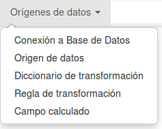
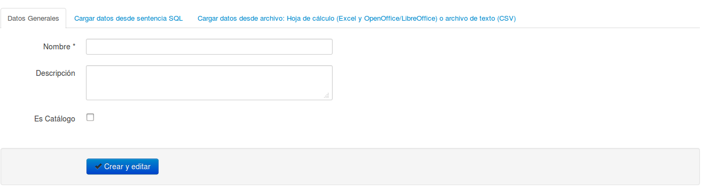
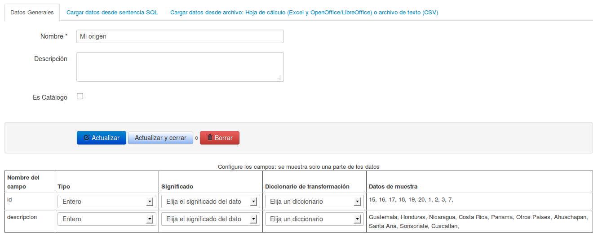

# ETL #
El bloque ETL (Extract Transform Load) es la sección dónde se configuran los orígenes de datos y se obtiene la información de ellos.
Contamos con las siguientes opciones en el menú principal:

## Conexión a bases de datos
Cuando los datos provienen de una base de datos ya existente, se debe configurar antes la conexión a ésta. Los motores soportados son: PostgreSQL, MySQL, SQL Server y Oracle.

Debemos ingresar los datos necesarios para configurar la conexión, una vez ingresados se puede probar la conexión con el botón **Probar Conexión** el cual nos devolverá un mensaje con el resultado de la prueba.

## Origen de datos
Para la creación de un origen de datos tenemos tres secciones: Datos generales que contendrá la descripción general del origen de datos, Cargar datos desde una sentencia SQL y Cargar datos desde archivo.

En la sección de datos generales debemos especificar el nombre del origen de datos, opcionalmente una descripción y si el origen de datos lo utilizaremos para cargar datos de tablas catálogos.

De las últimas dos secciones debemos seleccionar la que utilizaremos según el caso. Para cargar datos desde una sentencia SQL debemos seleccionar la conexión a la base de datos y especificar la sentencia SQL para extraer los datos, es recomendable probar la sentencia antes de guardarla con el botón **Probar Sentencia SQL** la cual mostrará un mensaje con el resultado de la prueba y un listado de datos de muestra en el caso que ejecución de la sentencia haya sido exitosa.

Y para cargar datos desde un archivo, debemos especificar la ruta del archivo, el cual puede ser una hoja electrónica (Excel hasta versión 2010 y OpenOffice/LibreOffice hasta versión 3.5 son soportados) o desde un archivo de texto con formato de valores separados por comas (CSV).

#### Configuración de un origen de datos
Al especificar las opciones necesarias en el formulario de origen de datos y dar clic en **Guardar y editar** se cargará una nueva sección en la parte inferior del formulario, por medio de la cual debemos configurar los datos obtenidos.

Es de suma importancia realizar esta configuración correctamente. Debemos especificar para cada campo su tipo, significado y si usará un diccionario de transformación.

El diccionario de transformación es un grupo de reglas para convertir un dato en otro, esto se podría usar en el caso de que se desee leer dos orígenes de datos pero 
el campo en cada uno de ellos utiliza valores diferentes, supongamos que el campo es sexo y que en un origen de datos femenino se representa por F y masculino por M; pero en el otro origen de datos femenino se representa por 1 y masculino por 2; en este caso será necesario transformar los valores de uno de los orígenes para que coincida con el otro.

El significado del campo determinará qué es lo que almacenará y por medio de éste se permitirá luego relacionar campos de diferentes orígenes de datos, un tipo de campo solo se puede aparecer una vez en cada origen de datos. Un campo con especial importancia es el **Campo para cálculos** el cual identificará el campo que se utilizará para realizar los cálculos dentro de la fórmula del indicador. Si algún campo contiene llaves foráneas se deberá seleccionar los tipos que comienzan con **Identificador** indicando que este dato tendrá asociado una tabla catálogo que ya debe estar cargada o que será cargada posteriormente en la base de datos. Por ejemplo para el caso de Departamento si está cargando el nombre del departamento el significado será *Departamento*. 
Por otro lado, si en lugar del nombre tiene la llave foránea deberá colocar como significado *Identificador departamento* y su valor debe coincidir con una llave id_departamento en la tabla catalogo ctl_departamento.  Recuerde que necesitará una tabla de catálogo de departamento, la asociación de la tabla se realiza cuando se crea un significado de campos.

### Carga de tablas catálogos 
El formulario de origen de datos además permite crear tablas catálogos (cuyas llaves se utilizarán como llaves foráneas en los orígenes de datos normales). Alternativamente las tablas catálogo pueden ser gestionadas con algún programa especializado para el manejo de bases de datos, esto es así puesto que cada implementación del Sistema de Indicadores puede tener diferentes catálogos. 
Cada catálogo permite asociar y analizar la información que se suba al sistema de distintas formas. Así por ejemplo si contamos con un catálogo de departamentos  (tabla ctl_depatamento) y dentro de este  catálogo están las columnas población, región  será posible filtrar y desplegar información para cada registro  sobre departamentos sus poblaciones y  la región a la que pertenecen. 
Entre más catálogos se utilicen, habrán mas posibilidades para analizar y presentar los datos. Es responsabilidad del administrador en cada implementación garantizar la gestión de las tablas catálogos.

##Diccionario de transformación
En esta opción definiremos el contenedor de Reglas de transformación, debemos especificar el código y la descripción que indique el objetivo del diccionario ya las reglas que contrendrá

##Regla de transformación
Una regla de transformación, se utilizará para convertir un valor en otro, esto con el objetivo de que si algunos orígenes de datos se refieren a un mismo campo pero con valores diferente con la transformación de uno de ellos se pueda hacer que estos valores sean iguales en ambos orígenes de datos.
Por ejemplo, supongamos que tenemos dos orígenes de datos que contienen el campo sexo, en un origen se utilizan los valores **Hombre** y **Mujer**; y en el otro origen de datos se utiliza **M** y **F**, para poder procesar estos orígenes de datos en un mismo indicador vamos a crear una regla que transforme **Hombre** a **H**. Por el momento solo se dispone de la regla **Igual**

##Campo Calculado
Dentro de un origen de datos podemos agregar un campo que se obtenga a partir de otros campos del mismo origen, esto es útil principalmente para orígenes de datos que son Pivote, para los otros orígenes de datos se recomienda que el campo calculado se obtenga desde la fuente de datos (hoja de cálculo, base de datos, etc)

Al elegir el origen de datos se recuperarán los campos de éste, los cuales podemos utilizar en la fórmula del campo calculado para los cual damos clic sobre el nombre del campo para que sea agregado. Además debemos especificar el significado del campo calculado

