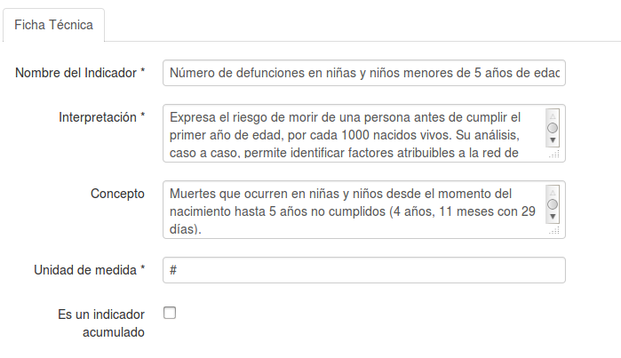
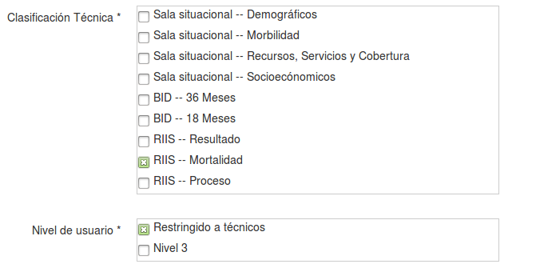
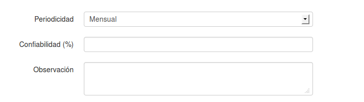
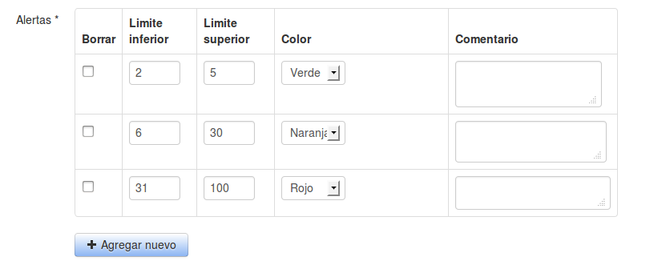

# Ficha técnica: Configuración del indicador
En esta sección se creará y configurará el indicador, esto se hace mediante una ficha técnica, la cual describe las características del indicador y su fórmula de cálculo.

Lo haremos a través de las siguientes opciones del menú principal:

## Variables
El primero paso a realizar en esta sección es la creación de las variables que intervienen en la fórmula para calcular el indicador.

La puntos más importantes para la correcta creación de una variables es especificar el origen de datos asociado, el nombre de la variable y sus iniciales.

## Ficha técnica
La ficha técnica es la que contendrá toda la descripción del indicador, el formulario de la ficha técnica es de los más largos, se explicará por partes.

### Datos generales
Describe los campos que describen al indicador: su nombre, uso, objetivo, unidad de medida etc.

### Definición de la fórmula
Se debe indicar las variables que se utilizarán en la fórmula del indicador y escribir la fórmula, tomando en cuenta:
1. Solo puede utilizar operadores matemáticos: /, *, +, - (, )
2. Para utilizar las variables debe escribir las iniciales de la variable entre llaves { }
3. Se verificará la sintaxis de la fórmula y que utilice las variables seleccionadas.

### Clasificación del indicador
La clasificación del indicador tiene las siguientes opciones: Clasificación técnica  y nivel de usuario

### Otros datos
Podemos especificar la confiabilidad de indicador, la periocidad de actualización de datos y alguna observación general.

### Alertas
Para la generación de alertas del indicador podemos establecer un valor estándar o una serie de rangos de valores y asignar un color y comentario que describa el comportamiento del indicador en ese rango de valores.

### Orden de dimensiones del indicador
Una vez guardado la ficha técnica, se realiza el cálculo de cuales son sus indicadores disponibles, lo cual se obtiene a partir de los campos comunes de las variables que intervienen en el cálculo del indicador. Se puede cambiar el orden por defecto en que se presentarán las dimensiones en el tablero, para eso editamos la ficha técnica y vamos al final del formulario, encontraremos las dimensiones del indicador y podemos especificar el orden arrastrando cada una de ellas.

