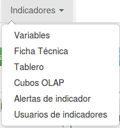

# FICHA TÉCNICA: Configuración del indicador #
En esta sección se creará y configurará el indicador, esto se hace mediante una ficha técnica, la cual describe las características del indicador y su fórmula de cálculo.

Lo haremos a través de las siguientes opciones del menú principal:

## Variables
El primero paso a realizar en esta sección es la creación de las variables que intervienen en la fórmula para calcular el indicador.

