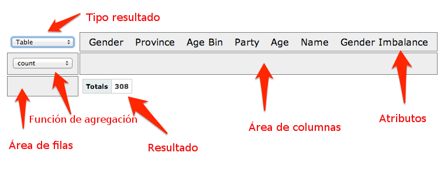
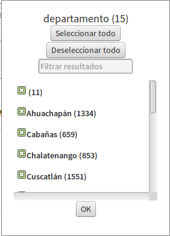
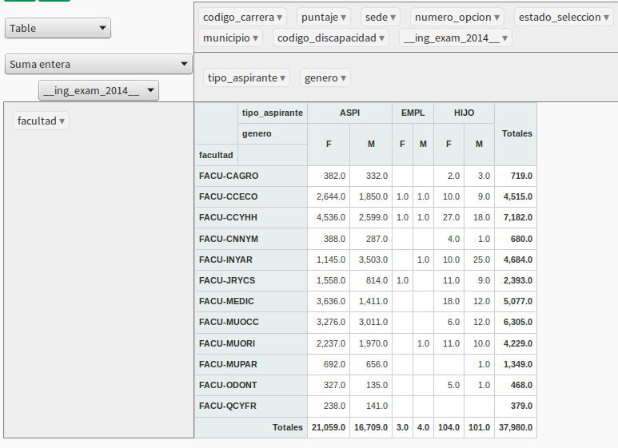
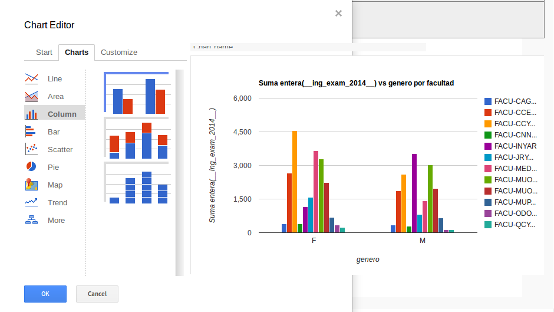

# Tabla Pivote
La función básica de la tabla pivote es convertir un conjunto de datos en una tabla resumen. Se puede manipular la tabla resumen utilizando su interfaz de usuario que permite arrastrar y soltar los campos en la disposición deseada y convirtiéndola en una tabla pivote, muy similar a la que se encuentra en las hojas de cálculo.
Además se puede utilizar gráficos para representar los datos en la tabla, generando un gráfico pivote.

## Descripción de la interfáz de usuario
Se dispone de dos secciones principales, una donde se elige el indicador, cuyos datos se desean cargar a la tabla pivote, y la sección que nos permitirá ver y manipular esta tabla.
La siguiente figura muestra la interfaz inicial de la tabla pivote

El siguiente punto es arrastrar los atributos deseados y soltarlos en las áreas filas y columnas, según se requiera. Por defecto se utiliza una tabla como tipo de resultado y contar como función de agregación. Además cada atributo puede ser filtrado a través dando clic en el triángulo al lado del nombre de cada atributo, la interfaz para filtrar será similar a la mostrada a la imagen:

Algunos de los tipos de resultado que se puede usar:

- Tabla
- Tabla con gráfico de barra
- Gráfico de línea
- Gráfico de barra
- Gráfico de área

Entre las funciones de agregación tenemos:

* Contar
* Suma
* Suma entera
* Promedio: Realiza la función de promedio aritmético
* Suma sobre suma: Utiliza dos atributos para su cálculo y se devuelve el cociente de ellos.
* Suma como fracción del total: Cada celda se calcula como porcentaje tomando como 100% el total general.
* Suma como fracción de filas: Cada celda se calcula como porcentaje tomando como 100% el total de la fila.
* Suma como fracción de columnas: Cada celda se calcula como porcentaje tomando como 100% el total de la columna. 

Si elegimos una función de agregación diferente a contar debemos especificar 
sobre qué atributo(s) se calculará la función

Una tabla pivote después de cierta manipulación podría quedar de la siguiente forma:

Al utilizar un gráfico pivote se mostraría un resultado similar al de la siguiente imagen:

Si presionamos doble clic sobre cualquier zona del gráfico, se abrirá un cuadro
de diálogo con un editor de gráficos, en el cual podemos elegir más tipos de gráficos
y configurarlo según nuestra conveniencia (título, colores, tipos de letras, etc.)

