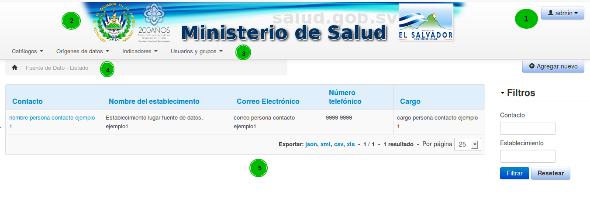
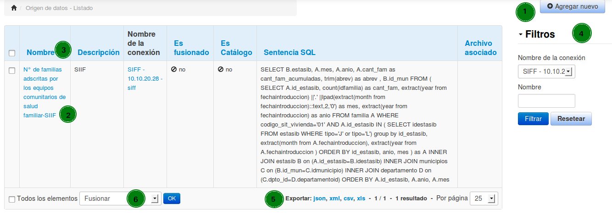

# Preliminares

## Flujo de trabajo
El flujo de trabajo principal, consiste en los siguientes pasos:

1. Configurar una conexión de donde se obtendrán los datos (Orígenes de datos -> Conexión a bases de datos -> Agregar Nuevo)
1. Crear el origen de datos, se puede extraer desde una base de datos o un archivo (Orígenes de datos -> Origen de datos -> Agregar Nuevo)
1. Configurar el origen de datos, se deben especificar el tipo y significado de cada campo (Orígenes de datos -> Origen de datos -> Seleccionar un origen para editar)
1. Crear las variables (Indicadores -> Variables -> Agregar Nuevo)
1. Crear la ficha técnica, la cual contendrá las especificaciones del indicador y la fórmula para calcularlo (Indicadores -> Ficha Técnica -> Agregar Nuevo)
1. Uso de los indicadores desde el tablero (Indicadores -> Tablero)

Pasos alternos:

1. Si los datos se obtendrán desde un archivo, no es necesario configurar una conexión a una base de datos

## Interfaz principal

1. Nombre del usuario actual y la opción para salir.
1. Logo/Imagen principal
1. Menú principal, se mostrarán las opciones de acuerdo al perfil del usuario
1. Barra de navegación. Contendrá las opciones en las cuales se ha ingresado
1. Área de trabajo

## Listado
La mayoría de interfaces se componen de un listado, desde la cual podemos realizar las siguientes acciones:

1. Crear un nuevo elemento
1. Seleccionar un elemento para Editar/Borrar
1. Cambiar el orden del listado
1. Aplicar filtros
1. Exportar los datos del listado
1. Realizar acciones sobre varios elementos

Al seleccionar un elemento podemos realizar más acciones sobre él

## Acciones sobre un elemento
Cuando se está creando un nuevo elemento se dispondrá en la parte inferior del formulario los siguientes botones de acción:

1. Crear y editar. Guarda los datos actuales y permanece el formulario abierto para edición
1. Crear y regresar al listado. Guarda los datos actuales y regresa a mostrar el listado.
1. Crear y agregar otro. Guarda los datos y muestra el formulario en blanco para agregar otro elemento

Si se está editando un elemento existente dispondremos de los siguientes botones de acción:

1. Actualizar. Guarda los cambios realizados y mantiene el formulario abierto para poder realizar más modificaciones.
1. Actualizar y cerrar. Guarda los cambios y vuelve al listado.
1. Borrar. Permite eliminar el elemento actual, se pedirá confirmación de la acción.

