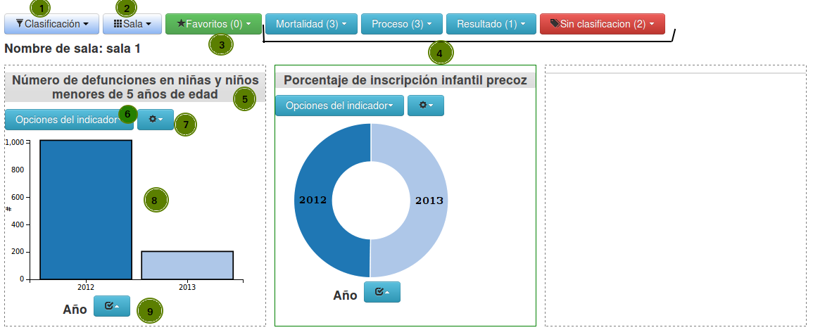
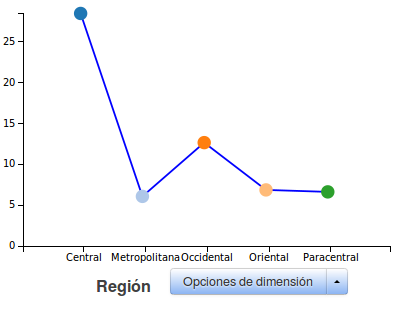

# Tablero de indicadores
El objetivo del trablero es proveer una herramienta para el análisis de los datos del indicador de manera dinámica y que el usuario pueda interactuar para mostrar los datos de la forma que más le sea útil.

El tablero se divide en las siguientes áreas:

1. Clasificación utilizada, de acuerdo a esta opción será los grupos mostrados en el numeral 4
2. Menú de sala, los gráficos se pueden agrupar en salas se puede guardar y recuperar una sala
3. Indicadores marcados como favoritos.
4. Agrupación de indicadores, dependerá de la opción elegida en el numeral 1.
5. Título del gráfico, se puede arrastar el gráfico por esta zona y ubicarlo en otra posición.
6. Opciones del gráfico del indicador: se puede ordenar usando los valores del indicador y el tipo de gráfico.
7. Opciones generales del indicador: Ver ficha técnica, ver tabla de datos, descargar gráfico, quitar indicador y marcar como favorito
8. Area del gráfico
9. Opciones de la dimensión utilizada en el gráfico, se refiere a la variable mostrada, podemos: ordenar, cambiar dimensión y filtrar.

## Filtros aplicados
Cada vez que se dé clic sobre un elemento del gráfico se creará un filtro con el valor seleccionado, podemos aplicar filtros de acuerdo a la cantidad de variables disponibles para el indicador, además se puede regresar y quitar un filtro dando clic en el nivel deseado

## Descripción de rangos de alertas
Si se han definidos rangos de alertas para el indicador se mostrará el cuadro con el detalle de estos rangos: límite inferior, límite superior, color del rango y un comentario explicativo.
Cada elemento del gráfico se mostrará con el color del rango al cual pertenece, si no existen rangos de alertas se usarán colores aleatoreos para mostrar el gráfico.

## Opciones del indicador

Podemos elegir el tipo de gráfico: Columnas, líneas, mapa y circular. El usuario podrá elegir el gráfico que represente mejor los datos, cada uno de estos gráficos es interactivo.
En el caso de que la variable sea de tipo geográfica y exista un mapa asociado a ella, se dispondrá de este tipo
de gráfico, para acercar el mapa se usará clic derecho de igual manera clic derecho sobre el mismo elemento
para alejar, si se da clic sobre otro elemento cuando el mapa tiene un acercamiento se pasará ese elemento al centro.

Ordenar por valor del indicador, con esta opciones podemos ordenar los elementos del gráfico tomando el valor del indicador como parámetro de ordenamiento.

## Opciones de dimensión

Cambiar dimensión: Podemos elegir la dimensión/variable que queremos graficar.
Ordenar: Ordena según el valor nombre de la dimensión/variable, nos será de mucha utilidad por ejemplo en el caso de que la variable sea año. En otras dimensiones solo hará un ordenamiento alfabético por ejemplo por nombre de municipio.

Filtrar: Podemos realizar el filtrado de los elementos que se muestran en el gráfico de dos formas

1. Todos los elementos que se muestran en el gráfico estarán disponibles como listado para poder seleccionar los que deseemos mostrar en el gráfico.
2. Filtrar por posición, elegimos que posiciones se mostrarán, por ejemplo los primeros 5 elementos, los últimos 10, desde el tercero al 7, etc.

Podemos combinar las diferentes opciones para adecuar el gráfico. Por ejemplo: Si queremos mostrar los 5 elementos con mayor índice, ordenamos el gráfico por indicador y aplicamos un filtro con límite superior 5

# Cubos OLAP

El objetivo de los Cubos OLAP es proveer una herramienta para el análisis de los datos del indicador de forma dinámica y que el usuario pueda seleccionar la combinacion de datos que le resulte mas efectiva para analizar la informacion disponible.

El tablero de cubos OLAP se divide en las siguientes áreas:

1. Menu de indicadores/cubos disponibles en el sistema.
2. Dimensiones disponibles para el indicador seleccionado.
3. Medidas disponibles para el indicador seleccionado.
4. Menu de funciones de manipulacion de datos 

