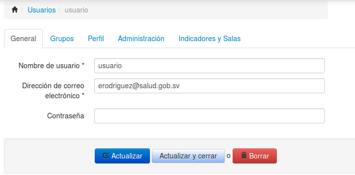
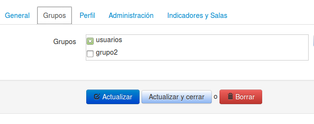
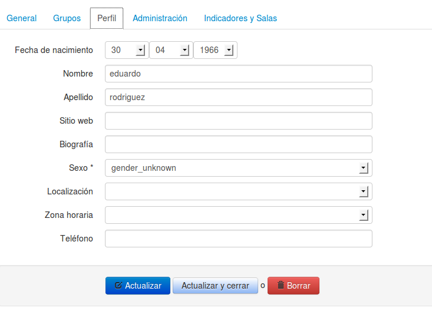
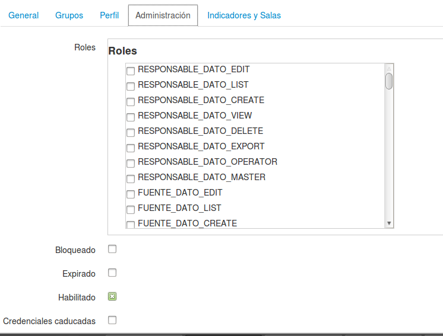
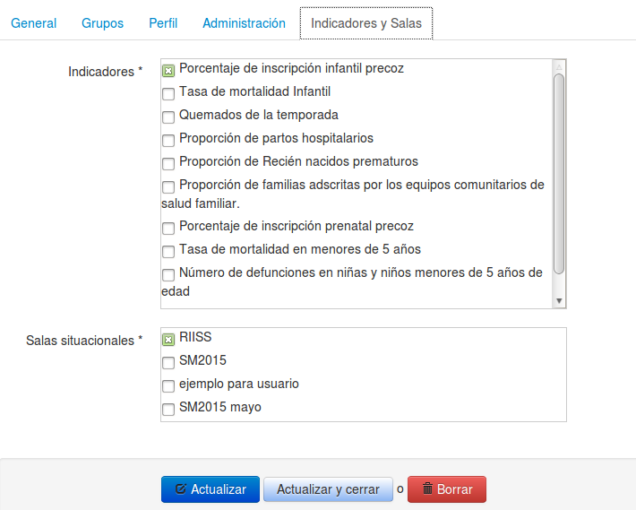

# Gestión de usuarios y grupos
Para la gestión de los usuario y grupos se utiliza la opción del menú **Usuarios y grupos**. Esta opción del menú aparecerá disponible solo para los usuarios con el perfil de administrador.

## Usuarios
Al seleccionar la opción **Usuarios** del menú Usuarios y grupos, se podrá realizar el mantenimiento de la información 
de cada usuario, primero aparecerá el listado de usuarios y se podrá seleccionar al dar clic en el nombre.

Al elegir un usuario podemos modificar su información, la cual está clasificada en 4 secciones:

1. General
1. Grupos
1. Perfil
1. Administración
1. Indicadores y Salas

###General

Aquí se puede modificar el nombre de usuario (con el que ingresa), el correo electrónico y la clave de acceso.

###Grupos

Se elijen los grupos a los que pertenece el usuario

###Perfil

Aquí se puede modificar los datos personales del usuario: Nombre, apellidos, sexo, fecha de nacimiento, teléfono, entre otros datos.

###Administración

En está opción se puede especificar el estado de la cuenta (deshabilitada, expirada, etc) y los roles/permisos del usuario , los cuales se corresponden con cada opción del menú más la acción que se puede realizar.
Por ejemplo: RESPONSABLE_DATO_CREATE le dará permiso para crear un elemento de la opción del menú Responsable Datos

| Atributo | Significado previsto |
| -- | --:|
| VIEW 	| Cuando le es permitido a alguien ver el objeto. |
| EXPORT 	| Tiene disponibles las opciones de exportar el listado de objetos |
| EDIT 	| Cuando le es permitido a alguien hacer cambios al objeto. |
| CREATE 	| Cuando a alguien se le permite crear el objeto. |
| DELETE 	| Cuando a alguien se le permite eliminar el objeto. |
| OPERATOR | Cuando le es permitido a alguien realizar todas las acciones anteriores. |
| MASTER 	| Cuando le es permitido a alguien realizar todas las acciones anteriores, y además tiene permitido conceder cualquiera de los permisos anteriores a otros. |

Además se dispone de roles generales.
Rol  | Significado
--|--
ROLE_USER | Rol de usuario normal
ROLE_SONATA_ADMIN | Rol de administrador, tendrá acceso a todas las opciones
ROLE_USER_TABLERO | Activa la opción de Tablero del menú Ficha Técnica
ROLE_USER_CUBOS | Activa la opción Cubos OLAP del menú Ficha Técnica

###Indicadores y Salas

Por medio de esta opción se le asignan los indicadores y salas que tendrá disponibles el usuario en el trablero

## Grupos
