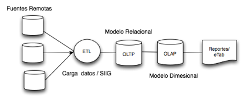
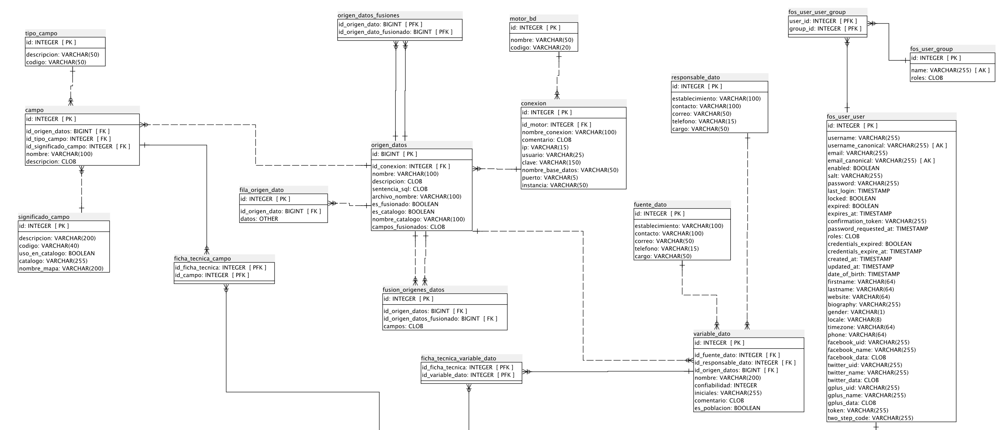
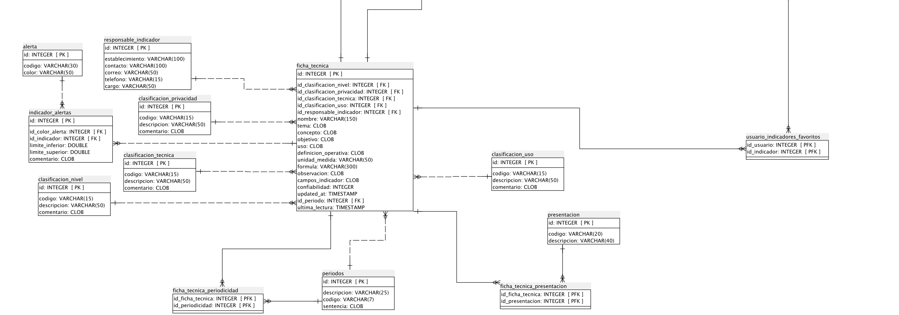

#Modelo De Datos

### Esquema general de la Aplicacion

Los datos que maneja el sistema provienen de distintas fuentes y son de una naturaleza tal que es necesario utilizar el modelo de
base datos sin esquema/genérico EAV. Las tabla EAV (Fila_origen_dato) y demás tablas auxiliares son parte del
almacenamiento de datos transaccional (OLTP) de la aplicación. Esto facilita el manejo de datos
de cualquier indicador sin importar sus propiedades. Los cubos de análisis multidimensional
(OLAP) son generados usando estos valores genéricos y estan descritos en la seccion de Gesition de Cubos OLAP.
Las tablas de los cubos OLAP usan un esquema de estrella mientras que las tablas del almacenamiento OLTP usan un modelo relacional.
El Siguiente Diccionario de Datos y Diagrama ER describen la estructura del almacenamiento transaccional (OLTP) de la Aplicacion.

### Diagrama Entidad Relacion

### Diccionario de Datos

#### Lista de tablas

<ul>
  <li> <a href="#alerta">alerta</a> </li>
  <li> <a href="#campo">campo</a> </li>
  <li> <a href="#clasificacion_nivel">clasificacion_nivel</a> </li>
  <li> <a href="#clasificacion_privacidad">clasificacion_privacidad</a> </li>
  <li> <a href="#clasificacion_tecnica">clasificacion_tecnica</a> </li>
  <li> <a href="#clasificacion_uso">clasificacion_uso</a> </li>
  <li> <a href="#conexion">conexion</a> </li>
  <li> <a href="#ficha_tecnica">ficha_tecnica</a> </li>
  <li> <a href="#ficha_tecnica_campo">ficha_tecnica_campo</a> </li>
  <li> <a href="#ficha_tecnica_periodicidad">ficha_tecnica_periodicidad</a> </li>
  <li> <a href="#ficha_tecnica_presentacion">ficha_tecnica_presentacion</a> </li>
  <li> <a href="#ficha_tecnica_variable_dato">ficha_tecnica_variable_dato</a> </li>
  <li> <a href="#fila_origen_dato">fila_origen_dato</a> </li>
  <li> <a href="#fos_user_group">fos_user_group</a> </li>
  <li> <a href="#fos_user_user">fos_user_user</a> </li>
  <li> <a href="#fos_user_user_group">fos_user_user_group</a> </li>
  <li> <a href="#fuente_dato">fuente_dato</a> </li>
  <li> <a href="#fusion_origenes_datos">fusion_origenes_datos</a> </li>
  <li> <a href="#indicador_alertas">indicador_alertas</a> </li>
  <li> <a href="#motor_bd">motor_bd</a> </li>
  <li> <a href="#origen_datos">origen_datos</a> </li>
  <li> <a href="#origen_datos_fusiones">origen_datos_fusiones</a> </li>
  <li> <a href="#periodos">periodos</a> </li>
  <li> <a href="#presentacion">presentacion</a> </li>
  <li> <a href="#responsable_dato">responsable_dato</a> </li>
  <li> <a href="#responsable_indicador">responsable_indicador</a> </li>
  <li> <a href="#significado_campo">significado_campo</a> </li>
  <li> <a href="#tipo_campo">tipo_campo</a> </li>
  <li> <a href="#usuario_indicadores_favoritos">usuario_indicadores_favoritos</a> </li>
  <li> <a href="#variable_dato">variable_dato</a> </li>
</ul>

  <h3>1. alerta </h3>

  <table class="tableDefinition" width="100%">
    <tr>
      <td class="tdTableHeading tdLogicalColName">Nomre Logico de Columna</td>
      <td class="tdTableHeading tdPhysicalColName">Nombre Fisico de Columna</td>
      <td class="tdTableHeading tdDataType">Tipo</td>
      <td class="tdTableHeading tdPkFlag">PK</td>
      <td class="tdTableHeading tdNullFlag">Nullable</td>
    </tr>
    <tr valign="top">
      <td class="tdTableDefinition">id (PK)</td>
      <td class="tdTableDefinition">id</td>
      <td class="tdTableDefinition">INTEGER</td>
      <td class="tdTableDefinition" nowrap>PK</td>
      <td class="tdTableDefinition" nowrap>NOT NULL</td>
    </tr>
    <tr valign="top">
      <td class="tdTableDefinition">codigo</td>
      <td class="tdTableDefinition">codigo</td>
      <td class="tdTableDefinition">VARCHAR(30)</td>
      <td class="tdTableDefinition" nowrap></td>
      <td class="tdTableDefinition" nowrap>NOT NULL</td>
    </tr>
    <tr valign="top">
      <td class="tdTableDefinition">color</td>
      <td class="tdTableDefinition">color</td>
      <td class="tdTableDefinition">VARCHAR(50)</td>
      <td class="tdTableDefinition" nowrap></td>
      <td class="tdTableDefinition" nowrap>NOT NULL</td>
    </tr>
  </table>
  
  
  Esta tabla es usada por: 
  
  <ul>
      <li><a href="#indicador_alertas">indicador_alertas</a>  hace referencia la campo (id)</li>
    </ul>
  

  <h3>2. campo</h3>

  <table class="tableDefinition" width="100%">
    <tr>
      <td class="tdTableHeading tdLogicalColName">Nomre Logico de Columna</td>
      <td class="tdTableHeading tdPhysicalColName">Nombre Fisico de Columna</td>
      <td class="tdTableHeading tdDataType">Tipo</td>
      <td class="tdTableHeading tdPkFlag">PK</td>
      <td class="tdTableHeading tdNullFlag">Nullable</td>
    </tr>
    <tr valign="top">
      <td class="tdTableDefinition">id (PK)</td>
      <td class="tdTableDefinition">id</td>
      <td class="tdTableDefinition">INTEGER</td>
      <td class="tdTableDefinition" nowrap>PK</td>
      <td class="tdTableDefinition" nowrap>NOT NULL</td>
    </tr>
    <tr valign="top">
      <td class="tdTableDefinition">id_origen_datos
        &nbsp;(<a href="#origen_datos">FK</a>) </td>
      <td class="tdTableDefinition">id_origen_datos</td>
      <td class="tdTableDefinition">BIGINT</td>
      <td class="tdTableDefinition" nowrap></td>
      <td class="tdTableDefinition" nowrap>NOT NULL</td>
    </tr>
    <tr valign="top">
      <td class="tdTableDefinition">id_tipo_campo
        &nbsp;(<a href="#tipo_campo">FK</a>) </td>
      <td class="tdTableDefinition">id_tipo_campo</td>
      <td class="tdTableDefinition">INTEGER</td>
      <td class="tdTableDefinition" nowrap></td>
      <td class="tdTableDefinition" nowrap>NOT NULL</td>
    </tr>
    <tr valign="top">
      <td class="tdTableDefinition">id_significado_campo
        &nbsp;(<a href="#significado_campo">FK</a>) </td>
      <td class="tdTableDefinition">id_significado_campo</td>
      <td class="tdTableDefinition">INTEGER</td>
      <td class="tdTableDefinition" nowrap></td>
      <td class="tdTableDefinition" nowrap>NOT NULL</td>
    </tr>
    <tr valign="top">
      <td class="tdTableDefinition">nombre</td>
      <td class="tdTableDefinition">nombre</td>
      <td class="tdTableDefinition">VARCHAR(100)</td>
      <td class="tdTableDefinition" nowrap></td>
      <td class="tdTableDefinition" nowrap>NOT NULL</td>
    </tr>
    <tr valign="top">
      <td class="tdTableDefinition">descripcion</td>
      <td class="tdTableDefinition">descripcion</td>
      <td class="tdTableDefinition">CLOB</td>
      <td class="tdTableDefinition" nowrap></td>
      <td class="tdTableDefinition" nowrap></td>
    </tr>
  </table>
  
  
  Esta tabla depende de:
  <ul>
      <li> <a href="#origen_datos">origen_datos</a> por medio de  (id_origen_datos)</li>
      <li> <a href="#tipo_campo">tipo_campo</a> por medio de  (id_tipo_campo)</li>
      <li> <a href="#significado_campo">significado_campo</a> por medio de  (id_significado_campo)</li>
    </ul>  
  
  Esta tabla es usada por: 
    
   <ul>
      <li> <a href="#ficha_tecnica_campo">ficha_tecnica_campo</a>  hace referencia la campo (id)</li>
    </ul>
  

  <h3>3. clasificacion_nivel</h3>

  <table class="tableDefinition" width="100%">
    <tr>
      <td class="tdTableHeading tdLogicalColName">Nomre Logico de Columna</td>
      <td class="tdTableHeading tdPhysicalColName">Nombre Fisico de Columna</td>
      <td class="tdTableHeading tdDataType">Tipo</td>
      <td class="tdTableHeading tdPkFlag">PK</td>
      <td class="tdTableHeading tdNullFlag">Nullable</td>
    </tr>
    <tr valign="top">
      <td class="tdTableDefinition">id (PK)</td>
      <td class="tdTableDefinition">id</td>
      <td class="tdTableDefinition">INTEGER</td>
      <td class="tdTableDefinition" nowrap>PK</td>
      <td class="tdTableDefinition" nowrap>NOT NULL</td>
    </tr>
    <tr valign="top">
      <td class="tdTableDefinition">codigo</td>
      <td class="tdTableDefinition">codigo</td>
      <td class="tdTableDefinition">VARCHAR(15)</td>
      <td class="tdTableDefinition" nowrap></td>
      <td class="tdTableDefinition" nowrap>NOT NULL</td>
    </tr>
    <tr valign="top">
      <td class="tdTableDefinition">descripcion</td>
      <td class="tdTableDefinition">descripcion</td>
      <td class="tdTableDefinition">VARCHAR(50)</td>
      <td class="tdTableDefinition" nowrap></td>
      <td class="tdTableDefinition" nowrap>NOT NULL</td>
    </tr>
    <tr valign="top">
      <td class="tdTableDefinition">comentario</td>
      <td class="tdTableDefinition">comentario</td>
      <td class="tdTableDefinition">CLOB</td>
      <td class="tdTableDefinition" nowrap></td>
      <td class="tdTableDefinition" nowrap></td>
    </tr>
  </table>
  
    
  Esta tabla es usada por: 
  
  <ul>
      <li> <a href="#ficha_tecnica">ficha_tecnica</a>  hace referencia la campo (id)</li>
    </ul>
  

  <h3>4. clasificacion_privacidad</h3>

  <table class="tableDefinition" width="100%">
    <tr>
      <td class="tdTableHeading tdLogicalColName">Nomre Logico de Columna</td>
      <td class="tdTableHeading tdPhysicalColName">Nombre Fisico de Columna</td>
      <td class="tdTableHeading tdDataType">Tipo</td>
      <td class="tdTableHeading tdPkFlag">PK</td>
      <td class="tdTableHeading tdNullFlag">Nullable</td>
    </tr>
    <tr valign="top">
      <td class="tdTableDefinition">id (PK)</td>
      <td class="tdTableDefinition">id</td>
      <td class="tdTableDefinition">INTEGER</td>
      <td class="tdTableDefinition" nowrap>PK</td>
      <td class="tdTableDefinition" nowrap>NOT NULL</td>
    </tr>
    <tr valign="top">
      <td class="tdTableDefinition">codigo</td>
      <td class="tdTableDefinition">codigo</td>
      <td class="tdTableDefinition">VARCHAR(15)</td>
      <td class="tdTableDefinition" nowrap></td>
      <td class="tdTableDefinition" nowrap>NOT NULL</td>
    </tr>
    <tr valign="top">
      <td class="tdTableDefinition">descripcion</td>
      <td class="tdTableDefinition">descripcion</td>
      <td class="tdTableDefinition">VARCHAR(50)</td>
      <td class="tdTableDefinition" nowrap></td>
      <td class="tdTableDefinition" nowrap>NOT NULL</td>
    </tr>
    <tr valign="top">
      <td class="tdTableDefinition">comentario</td>
      <td class="tdTableDefinition">comentario</td>
      <td class="tdTableDefinition">CLOB</td>
      <td class="tdTableDefinition" nowrap></td>
      <td class="tdTableDefinition" nowrap></td>
    </tr>
  </table>
  
    
  Esta tabla es usada por: 
  
  <ul>
      <li> <a href="#ficha_tecnica">ficha_tecnica</a>  hace referencia la campo (id)</li>
    </ul>
  

  <h3>5. clasificacion_tecnica</h3>

  <table class="tableDefinition" width="100%">
    <tr>
      <td class="tdTableHeading tdLogicalColName">Nomre Logico de Columna</td>
      <td class="tdTableHeading tdPhysicalColName">Nombre Fisico de Columna</td>
      <td class="tdTableHeading tdDataType">Tipo</td>
      <td class="tdTableHeading tdPkFlag">PK</td>
      <td class="tdTableHeading tdNullFlag">Nullable</td>
    </tr>
    <tr valign="top">
      <td class="tdTableDefinition">id (PK)</td>
      <td class="tdTableDefinition">id</td>
      <td class="tdTableDefinition">INTEGER</td>
      <td class="tdTableDefinition" nowrap>PK</td>
      <td class="tdTableDefinition" nowrap>NOT NULL</td>
    </tr>
    <tr valign="top">
      <td class="tdTableDefinition">codigo</td>
      <td class="tdTableDefinition">codigo</td>
      <td class="tdTableDefinition">VARCHAR(15)</td>
      <td class="tdTableDefinition" nowrap></td>
      <td class="tdTableDefinition" nowrap>NOT NULL</td>
    </tr>
    <tr valign="top">
      <td class="tdTableDefinition">descripcion</td>
      <td class="tdTableDefinition">descripcion</td>
      <td class="tdTableDefinition">VARCHAR(50)</td>
      <td class="tdTableDefinition" nowrap></td>
      <td class="tdTableDefinition" nowrap>NOT NULL</td>
    </tr>
    <tr valign="top">
      <td class="tdTableDefinition">comentario</td>
      <td class="tdTableDefinition">comentario</td>
      <td class="tdTableDefinition">CLOB</td>
      <td class="tdTableDefinition" nowrap></td>
      <td class="tdTableDefinition" nowrap></td>
    </tr>
  </table>
  
  Esta tabla es usada por: 
    
  <ul>
      <li> <a href="#ficha_tecnica">ficha_tecnica</a>  hace referencia la campo (id)</li>
    </ul>
  

  <h3>6. clasificacion_uso</h3>

  <table class="tableDefinition" width="100%">
    <tr>
      <td class="tdTableHeading tdLogicalColName">Nomre Logico de Columna</td>
      <td class="tdTableHeading tdPhysicalColName">Nombre Fisico de Columna</td>
      <td class="tdTableHeading tdDataType">Tipo</td>
      <td class="tdTableHeading tdPkFlag">PK</td>
      <td class="tdTableHeading tdNullFlag">Nullable</td>
    </tr>
    <tr valign="top">
      <td class="tdTableDefinition">id (PK)</td>
      <td class="tdTableDefinition">id</td>
      <td class="tdTableDefinition">INTEGER</td>
      <td class="tdTableDefinition" nowrap>PK</td>
      <td class="tdTableDefinition" nowrap>NOT NULL</td>
    </tr>
    <tr valign="top">
      <td class="tdTableDefinition">codigo</td>
      <td class="tdTableDefinition">codigo</td>
      <td class="tdTableDefinition">VARCHAR(15)</td>
      <td class="tdTableDefinition" nowrap></td>
      <td class="tdTableDefinition" nowrap>NOT NULL</td>
    </tr>
    <tr valign="top">
      <td class="tdTableDefinition">descripcion</td>
      <td class="tdTableDefinition">descripcion</td>
      <td class="tdTableDefinition">VARCHAR(50)</td>
      <td class="tdTableDefinition" nowrap></td>
      <td class="tdTableDefinition" nowrap>NOT NULL</td>
    </tr>
    <tr valign="top">
      <td class="tdTableDefinition">comentario</td>
      <td class="tdTableDefinition">comentario</td>
      <td class="tdTableDefinition">CLOB</td>
      <td class="tdTableDefinition" nowrap></td>
      <td class="tdTableDefinition" nowrap></td>
    </tr>
  </table>
  
  Esta tabla es usada por: 
  
  <ul>
      <li> <a href="#ficha_tecnica">ficha_tecnica</a>  hace referencia la campo (id)</li>
    </ul>
  

  <h3>7. conexion</h3>

  <table class="tableDefinition" width="100%">
    <tr>
      <td class="tdTableHeading tdLogicalColName">Nomre Logico de Columna</td>
      <td class="tdTableHeading tdPhysicalColName">Nombre Fisico de Columna</td>
      <td class="tdTableHeading tdDataType">Tipo</td>
      <td class="tdTableHeading tdPkFlag">PK</td>
      <td class="tdTableHeading tdNullFlag">Nullable</td>
    </tr>
    <tr valign="top">
      <td class="tdTableDefinition">id (PK)</td>
      <td class="tdTableDefinition">id</td>
      <td class="tdTableDefinition">INTEGER</td>
      <td class="tdTableDefinition" nowrap>PK</td>
      <td class="tdTableDefinition" nowrap>NOT NULL</td>
    </tr>
    <tr valign="top">
      <td class="tdTableDefinition">id_motor
        &nbsp;(<a href="#motor_bd">FK</a>) </td>
      <td class="tdTableDefinition">id_motor</td>
      <td class="tdTableDefinition">INTEGER</td>
      <td class="tdTableDefinition" nowrap></td>
      <td class="tdTableDefinition" nowrap>NOT NULL</td>
    </tr>
    <tr valign="top">
      <td class="tdTableDefinition">nombre_conexion</td>
      <td class="tdTableDefinition">nombre_conexion</td>
      <td class="tdTableDefinition">VARCHAR(100)</td>
      <td class="tdTableDefinition" nowrap></td>
      <td class="tdTableDefinition" nowrap>NOT NULL</td>
    </tr>
    <tr valign="top">
      <td class="tdTableDefinition">comentario</td>
      <td class="tdTableDefinition">comentario</td>
      <td class="tdTableDefinition">CLOB</td>
      <td class="tdTableDefinition" nowrap></td>
      <td class="tdTableDefinition" nowrap></td>
    </tr>
    <tr valign="top">
      <td class="tdTableDefinition">ip</td>
      <td class="tdTableDefinition">ip</td>
      <td class="tdTableDefinition">VARCHAR(15)</td>
      <td class="tdTableDefinition" nowrap></td>
      <td class="tdTableDefinition" nowrap>NOT NULL</td>
    </tr>
    <tr valign="top">
      <td class="tdTableDefinition">usuario</td>
      <td class="tdTableDefinition">usuario</td>
      <td class="tdTableDefinition">VARCHAR(25)</td>
      <td class="tdTableDefinition" nowrap></td>
      <td class="tdTableDefinition" nowrap>NOT NULL</td>
    </tr>
    <tr valign="top">
      <td class="tdTableDefinition">clave</td>
      <td class="tdTableDefinition">clave</td>
      <td class="tdTableDefinition">VARCHAR(150)</td>
      <td class="tdTableDefinition" nowrap></td>
      <td class="tdTableDefinition" nowrap>NOT NULL</td>
    </tr>
    <tr valign="top">
      <td class="tdTableDefinition">nombre_base_datos</td>
      <td class="tdTableDefinition">nombre_base_datos</td>
      <td class="tdTableDefinition">VARCHAR(50)</td>
      <td class="tdTableDefinition" nowrap></td>
      <td class="tdTableDefinition" nowrap>NOT NULL</td>
    </tr>
    <tr valign="top">
      <td class="tdTableDefinition">puerto</td>
      <td class="tdTableDefinition">puerto</td>
      <td class="tdTableDefinition">VARCHAR(5)</td>
      <td class="tdTableDefinition" nowrap></td>
      <td class="tdTableDefinition" nowrap></td>
    </tr>
    <tr valign="top">
      <td class="tdTableDefinition">instancia</td>
      <td class="tdTableDefinition">instancia</td>
      <td class="tdTableDefinition">VARCHAR(50)</td>
      <td class="tdTableDefinition" nowrap></td>
      <td class="tdTableDefinition" nowrap></td>
    </tr>
  </table>
  
  Esta tabla depende de:
    
  <ul>
      <li> <a href="#motor_bd">motor_bd</a> por medio de  (id_motor)</li>
    </ul>
  
  Esta tabla es usada por: 
  <ul>
      <li> <a href="#origen_datos">origen_datos</a>  hace referencia la campo (id)</li>
    </ul>
  

  <h3>8. ficha_tecnica</h3>

  <table class="tableDefinition" width="100%">
    <tr>
      <td class="tdTableHeading tdLogicalColName">Nomre Logico de Columna</td>
      <td class="tdTableHeading tdPhysicalColName">Nombre Fisico de Columna</td>
      <td class="tdTableHeading tdDataType">Tipo</td>
      <td class="tdTableHeading tdPkFlag">PK</td>
      <td class="tdTableHeading tdNullFlag">Nullable</td>
    </tr>
    <tr valign="top">
      <td class="tdTableDefinition">id (PK)</td>
      <td class="tdTableDefinition">id</td>
      <td class="tdTableDefinition">INTEGER</td>
      <td class="tdTableDefinition" nowrap>PK</td>
      <td class="tdTableDefinition" nowrap>NOT NULL</td>
    </tr>
    <tr valign="top">
      <td class="tdTableDefinition">id_clasificacion_nivel
        &nbsp;(<a href="#clasificacion_nivel">FK</a>) </td>
      <td class="tdTableDefinition">id_clasificacion_nivel</td>
      <td class="tdTableDefinition">INTEGER</td>
      <td class="tdTableDefinition" nowrap></td>
      <td class="tdTableDefinition" nowrap>NOT NULL</td>
    </tr>
    <tr valign="top">
      <td class="tdTableDefinition">id_clasificacion_privacidad
        &nbsp;(<a href="#clasificacion_privacidad">FK</a>) </td>
      <td class="tdTableDefinition">id_clasificacion_privacidad</td>
      <td class="tdTableDefinition">INTEGER</td>
      <td class="tdTableDefinition" nowrap></td>
      <td class="tdTableDefinition" nowrap>NOT NULL</td>
    </tr>
    <tr valign="top">
      <td class="tdTableDefinition">id_clasificacion_tecnica
        &nbsp;(<a href="#clasificacion_tecnica">FK</a>) </td>
      <td class="tdTableDefinition">id_clasificacion_tecnica</td>
      <td class="tdTableDefinition">INTEGER</td>
      <td class="tdTableDefinition" nowrap></td>
      <td class="tdTableDefinition" nowrap>NOT NULL</td>
    </tr>
    <tr valign="top">
      <td class="tdTableDefinition">id_clasificacion_uso
        &nbsp;(<a href="#clasificacion_uso">FK</a>) </td>
      <td class="tdTableDefinition">id_clasificacion_uso</td>
      <td class="tdTableDefinition">INTEGER</td>
      <td class="tdTableDefinition" nowrap></td>
      <td class="tdTableDefinition" nowrap>NOT NULL</td>
    </tr>
    <tr valign="top">
      <td class="tdTableDefinition">id_responsable_indicador
        &nbsp;(<a href="#responsable_indicador">FK</a>) </td>
      <td class="tdTableDefinition">id_responsable_indicador</td>
      <td class="tdTableDefinition">INTEGER</td>
      <td class="tdTableDefinition" nowrap></td>
      <td class="tdTableDefinition" nowrap>NOT NULL</td>
    </tr>
    <tr valign="top">
      <td class="tdTableDefinition">nombre</td>
      <td class="tdTableDefinition">nombre</td>
      <td class="tdTableDefinition">VARCHAR(150)</td>
      <td class="tdTableDefinition" nowrap></td>
      <td class="tdTableDefinition" nowrap>NOT NULL</td>
    </tr>
    <tr valign="top">
      <td class="tdTableDefinition">tema</td>
      <td class="tdTableDefinition">tema</td>
      <td class="tdTableDefinition">CLOB</td>
      <td class="tdTableDefinition" nowrap></td>
      <td class="tdTableDefinition" nowrap>NOT NULL</td>
    </tr>
    <tr valign="top">
      <td class="tdTableDefinition">concepto</td>
      <td class="tdTableDefinition">concepto</td>
      <td class="tdTableDefinition">CLOB</td>
      <td class="tdTableDefinition" nowrap></td>
      <td class="tdTableDefinition" nowrap></td>
    </tr>
    <tr valign="top">
      <td class="tdTableDefinition">objetivo</td>
      <td class="tdTableDefinition">objetivo</td>
      <td class="tdTableDefinition">CLOB</td>
      <td class="tdTableDefinition" nowrap></td>
      <td class="tdTableDefinition" nowrap></td>
    </tr>
    <tr valign="top">
      <td class="tdTableDefinition">uso</td>
      <td class="tdTableDefinition">uso</td>
      <td class="tdTableDefinition">CLOB</td>
      <td class="tdTableDefinition" nowrap></td>
      <td class="tdTableDefinition" nowrap></td>
    </tr>
    <tr valign="top">
      <td class="tdTableDefinition">definicion_operativa</td>
      <td class="tdTableDefinition">definicion_operativa</td>
      <td class="tdTableDefinition">CLOB</td>
      <td class="tdTableDefinition" nowrap></td>
      <td class="tdTableDefinition" nowrap></td>
    </tr>
    <tr valign="top">
      <td class="tdTableDefinition">unidad_medida</td>
      <td class="tdTableDefinition">unidad_medida</td>
      <td class="tdTableDefinition">VARCHAR(50)</td>
      <td class="tdTableDefinition" nowrap></td>
      <td class="tdTableDefinition" nowrap>NOT NULL</td>
    </tr>
    <tr valign="top">
      <td class="tdTableDefinition">formula</td>
      <td class="tdTableDefinition">formula</td>
      <td class="tdTableDefinition">VARCHAR(300)</td>
      <td class="tdTableDefinition" nowrap></td>
      <td class="tdTableDefinition" nowrap>NOT NULL</td>
    </tr>
    <tr valign="top">
      <td class="tdTableDefinition">observacion</td>
      <td class="tdTableDefinition">observacion</td>
      <td class="tdTableDefinition">CLOB</td>
      <td class="tdTableDefinition" nowrap></td>
      <td class="tdTableDefinition" nowrap></td>
    </tr>
    <tr valign="top">
      <td class="tdTableDefinition">campos_indicador</td>
      <td class="tdTableDefinition">campos_indicador</td>
      <td class="tdTableDefinition">CLOB</td>
      <td class="tdTableDefinition" nowrap></td>
      <td class="tdTableDefinition" nowrap></td>
    </tr>
    <tr valign="top">
      <td class="tdTableDefinition">confiabilidad</td>
      <td class="tdTableDefinition">confiabilidad</td>
      <td class="tdTableDefinition">INTEGER</td>
      <td class="tdTableDefinition" nowrap></td>
      <td class="tdTableDefinition" nowrap></td>
    </tr>
    <tr valign="top">
      <td class="tdTableDefinition">updated_at</td>
      <td class="tdTableDefinition">updated_at</td>
      <td class="tdTableDefinition">TIMESTAMP</td>
      <td class="tdTableDefinition" nowrap></td>
      <td class="tdTableDefinition" nowrap></td>
    </tr>
    <tr valign="top">
      <td class="tdTableDefinition">id_periodo
        &nbsp;(<a href="#periodos">FK</a>) </td>
      <td class="tdTableDefinition">id_periodo</td>
      <td class="tdTableDefinition">INTEGER</td>
      <td class="tdTableDefinition" nowrap></td>
      <td class="tdTableDefinition" nowrap>NOT NULL</td>
    </tr>
    <tr valign="top">
      <td class="tdTableDefinition">ultima_lectura</td>
      <td class="tdTableDefinition">ultima_lectura</td>
      <td class="tdTableDefinition">TIMESTAMP</td>
      <td class="tdTableDefinition" nowrap></td>
      <td class="tdTableDefinition" nowrap></td>
    </tr>
  </table>
  
  Esta tabla depende de:
  <ul>
      <li> <a href="#periodos">periodos</a> por medio de  (id_periodo)</li>
      <li> <a href="#clasificacion_privacidad">clasificacion_privacidad</a> por medio de  (id_clasificacion_privacidad)</li>
      <li> <a href="#clasificacion_tecnica">clasificacion_tecnica</a> por medio de  (id_clasificacion_tecnica)</li>
      <li> <a href="#clasificacion_uso">clasificacion_uso</a> por medio de  (id_clasificacion_uso)</li>
      <li> <a href="#clasificacion_nivel">clasificacion_nivel</a> por medio de  (id_clasificacion_nivel)</li>
      <li> <a href="#responsable_indicador">responsable_indicador</a> por medio de  (id_responsable_indicador)</li>
    </ul>
    
  Esta tabla es usada por: 
  <ul>
      <li> <a href="#ficha_tecnica_periodicidad">ficha_tecnica_periodicidad</a>  hace referencia la campo (id)</li>
      <li> <a href="#ficha_tecnica_campo">ficha_tecnica_campo</a>  hace referencia la campo (id)</li>
      <li> <a href="#ficha_tecnica_presentacion">ficha_tecnica_presentacion</a>  hace referencia la campo (id)</li>
      <li> <a href="#indicador_alertas">indicador_alertas</a>  hace referencia la campo (id)</li>
      <li> <a href="#ficha_tecnica_variable_dato">ficha_tecnica_variable_dato</a>  hace referencia la campo (id)</li>
      <li> <a href="#usuario_indicadores_favoritos">usuario_indicadores_favoritos</a>  hace referencia la campo (id)</li>
    </ul>
  

  <h3>9. ficha_tecnica_campo</h3>

  <table class="tableDefinition" width="100%">
    <tr>
      <td class="tdTableHeading tdLogicalColName">Nomre Logico de Columna</td>
      <td class="tdTableHeading tdPhysicalColName">Nombre Fisico de Columna</td>
      <td class="tdTableHeading tdDataType">Tipo</td>
      <td class="tdTableHeading tdPkFlag">PK</td>
      <td class="tdTableHeading tdNullFlag">Nullable</td>
    </tr>
    <tr valign="top">
      <td class="tdTableDefinition">id_ficha_tecnica (PK)
        &nbsp;(<a href="#ficha_tecnica">FK</a>) </td>
      <td class="tdTableDefinition">id_ficha_tecnica</td>
      <td class="tdTableDefinition">INTEGER</td>
      <td class="tdTableDefinition" nowrap>PK</td>
      <td class="tdTableDefinition" nowrap>NOT NULL</td>
    </tr>
    <tr valign="top">
      <td class="tdTableDefinition">id_campo (PK)
        &nbsp;(<a href="#campo">FK</a>) </td>
      <td class="tdTableDefinition">id_campo</td>
      <td class="tdTableDefinition">INTEGER</td>
      <td class="tdTableDefinition" nowrap>PK</td>
      <td class="tdTableDefinition" nowrap>NOT NULL</td>
    </tr>
  </table>
  
  Esta tabla depende de:
  <ul>
      <li> <a href="#campo">campo</a> por medio de  (id_campo)</li>
      <li> <a href="#ficha_tecnica">ficha_tecnica</a> por medio de  (id_ficha_tecnica)</li>
    </ul>
  

  <h3>10. ficha_tecnica_periodicidad</h3>

  <table class="tableDefinition" width="100%">
    <tr>
      <td class="tdTableHeading tdLogicalColName">Nomre Logico de Columna</td>
      <td class="tdTableHeading tdPhysicalColName">Nombre Fisico de Columna</td>
      <td class="tdTableHeading tdDataType">Tipo</td>
      <td class="tdTableHeading tdPkFlag">PK</td>
      <td class="tdTableHeading tdNullFlag">Nullable</td>
    </tr>
    <tr valign="top">
      <td class="tdTableDefinition">id_ficha_tecnica (PK)
        &nbsp;(<a href="#ficha_tecnica">FK</a>) </td>
      <td class="tdTableDefinition">id_ficha_tecnica</td>
      <td class="tdTableDefinition">INTEGER</td>
      <td class="tdTableDefinition" nowrap>PK</td>
      <td class="tdTableDefinition" nowrap>NOT NULL</td>
    </tr>
    <tr valign="top">
      <td class="tdTableDefinition">id_periodicidad (PK)
        &nbsp;(<a href="#periodos">FK</a>) </td>
      <td class="tdTableDefinition">id_periodicidad</td>
      <td class="tdTableDefinition">INTEGER</td>
      <td class="tdTableDefinition" nowrap>PK</td>
      <td class="tdTableDefinition" nowrap>NOT NULL</td>
    </tr>
  </table>
  
  Esta tabla depende de:
  <ul>
      <li> <a href="#periodos">periodos</a> por medio de  (id_periodicidad)</li>
      <li> <a href="#ficha_tecnica">ficha_tecnica</a> por medio de  (id_ficha_tecnica)</li>
    </ul>
  

  <h3>11. ficha_tecnica_presentacion</h3>

  <table class="tableDefinition" width="100%">
    <tr>
      <td class="tdTableHeading tdLogicalColName">Nomre Logico de Columna</td>
      <td class="tdTableHeading tdPhysicalColName">Nombre Fisico de Columna</td>
      <td class="tdTableHeading tdDataType">Tipo</td>
      <td class="tdTableHeading tdPkFlag">PK</td>
      <td class="tdTableHeading tdNullFlag">Nullable</td>
    </tr>
    <tr valign="top">
      <td class="tdTableDefinition">id_ficha_tecnica (PK)
        &nbsp;(<a href="#ficha_tecnica">FK</a>) </td>
      <td class="tdTableDefinition">id_ficha_tecnica</td>
      <td class="tdTableDefinition">INTEGER</td>
      <td class="tdTableDefinition" nowrap>PK</td>
      <td class="tdTableDefinition" nowrap>NOT NULL</td>
    </tr>
    <tr valign="top">
      <td class="tdTableDefinition">id_presentacion (PK)
        &nbsp;(<a href="#presentacion">FK</a>) </td>
      <td class="tdTableDefinition">id_presentacion</td>
      <td class="tdTableDefinition">INTEGER</td>
      <td class="tdTableDefinition" nowrap>PK</td>
      <td class="tdTableDefinition" nowrap>NOT NULL</td>
    </tr>
  </table>
  
  Esta tabla depende de:
  <ul>
      <li> <a href="#ficha_tecnica">ficha_tecnica</a> por medio de  (id_ficha_tecnica)</li>
      <li> <a href="#presentacion">presentacion</a> por medio de  (id_presentacion)</li>
    </ul>
  

  <h3>12. ficha_tecnica_variable_dato</h3>

  <table class="tableDefinition" width="100%">
    <tr>
      <td class="tdTableHeading tdLogicalColName">Nomre Logico de Columna</td>
      <td class="tdTableHeading tdPhysicalColName">Nombre Fisico de Columna</td>
      <td class="tdTableHeading tdDataType">Tipo</td>
      <td class="tdTableHeading tdPkFlag">PK</td>
      <td class="tdTableHeading tdNullFlag">Nullable</td>
    </tr>
    <tr valign="top">
      <td class="tdTableDefinition">id_ficha_tecnica (PK)
        &nbsp;(<a href="#ficha_tecnica">FK</a>) </td>
      <td class="tdTableDefinition">id_ficha_tecnica</td>
      <td class="tdTableDefinition">INTEGER</td>
      <td class="tdTableDefinition" nowrap>PK</td>
      <td class="tdTableDefinition" nowrap>NOT NULL</td>
    </tr>
    <tr valign="top">
      <td class="tdTableDefinition">id_variable_dato (PK)
        &nbsp;(<a href="#variable_dato">FK</a>) </td>
      <td class="tdTableDefinition">id_variable_dato</td>
      <td class="tdTableDefinition">INTEGER</td>
      <td class="tdTableDefinition" nowrap>PK</td>
      <td class="tdTableDefinition" nowrap>NOT NULL</td>
    </tr>
  </table>
  
  Esta tabla depende de:
  <ul>
      <li> <a href="#ficha_tecnica">ficha_tecnica</a> por medio de  (id_ficha_tecnica)</li>
      <li> <a href="#variable_dato">variable_dato</a> por medio de  (id_variable_dato)</li>
    </ul>
  

  <h3>13. fila_origen_dato</h3>

  <table class="tableDefinition" width="100%">
    <tr>
      <td class="tdTableHeading tdLogicalColName">Nomre Logico de Columna</td>
      <td class="tdTableHeading tdPhysicalColName">Nombre Fisico de Columna</td>
      <td class="tdTableHeading tdDataType">Tipo</td>
      <td class="tdTableHeading tdPkFlag">PK</td>
      <td class="tdTableHeading tdNullFlag">Nullable</td>
    </tr>
    <tr valign="top">
      <td class="tdTableDefinition">id (PK)</td>
      <td class="tdTableDefinition">id</td>
      <td class="tdTableDefinition">INTEGER</td>
      <td class="tdTableDefinition" nowrap>PK</td>
      <td class="tdTableDefinition" nowrap>NOT NULL</td>
    </tr>
    <tr valign="top">
      <td class="tdTableDefinition">id_origen_dato
        &nbsp;(<a href="#origen_datos">FK</a>) </td>
      <td class="tdTableDefinition">id_origen_dato</td>
      <td class="tdTableDefinition">BIGINT</td>
      <td class="tdTableDefinition" nowrap></td>
      <td class="tdTableDefinition" nowrap>NOT NULL</td>
    </tr>
    <tr valign="top">
      <td class="tdTableDefinition">datos</td>
      <td class="tdTableDefinition">datos</td>
      <td class="tdTableDefinition">[1111]</td>
      <td class="tdTableDefinition" nowrap></td>
      <td class="tdTableDefinition" nowrap></td>
    </tr>
  </table>
  
  Esta tabla depende de:
  <ul>
      <li> <a href="#origen_datos">origen_datos</a> por medio de  (id_origen_dato)</li>
    </ul>
  

  <h3>14. fos_user_group</h3>

  <table class="tableDefinition" width="100%">
    <tr>
      <td class="tdTableHeading tdLogicalColName">Nomre Logico de Columna</td>
      <td class="tdTableHeading tdPhysicalColName">Nombre Fisico de Columna</td>
      <td class="tdTableHeading tdDataType">Tipo</td>
      <td class="tdTableHeading tdPkFlag">PK</td>
      <td class="tdTableHeading tdNullFlag">Nullable</td>
    </tr>
    <tr valign="top">
      <td class="tdTableDefinition">id (PK)</td>
      <td class="tdTableDefinition">id</td>
      <td class="tdTableDefinition">INTEGER</td>
      <td class="tdTableDefinition" nowrap>PK</td>
      <td class="tdTableDefinition" nowrap>NOT NULL</td>
    </tr>
    <tr valign="top">
      <td class="tdTableDefinition">name</td>
      <td class="tdTableDefinition">name</td>
      <td class="tdTableDefinition">VARCHAR(255)</td>
      <td class="tdTableDefinition" nowrap></td>
      <td class="tdTableDefinition" nowrap>NOT NULL</td>
    </tr>
    <tr valign="top">
      <td class="tdTableDefinition">roles</td>
      <td class="tdTableDefinition">roles</td>
      <td class="tdTableDefinition">CLOB</td>
      <td class="tdTableDefinition" nowrap></td>
      <td class="tdTableDefinition" nowrap>NOT NULL</td>
    </tr>
    <tr>
      <td colspan="4">(DC2Tipo:array)</td>
    </tr>
  </table>
  
  Esta tabla es usada por: 
  <ul>
      <li> <a href="#fos_user_user_group">fos_user_user_group</a>  hace referencia la campo (id)</li>
    </ul>
  

  <h3>15. fos_user_user</h3>

  <table class="tableDefinition" width="100%">
    <tr>
      <td class="tdTableHeading tdLogicalColName">Nomre Logico de Columna</td>
      <td class="tdTableHeading tdPhysicalColName">Nombre Fisico de Columna</td>
      <td class="tdTableHeading tdDataType">Tipo</td>
      <td class="tdTableHeading tdPkFlag">PK</td>
      <td class="tdTableHeading tdNullFlag">Nullable</td>
    </tr>
    <tr valign="top">
      <td class="tdTableDefinition">id (PK)</td>
      <td class="tdTableDefinition">id</td>
      <td class="tdTableDefinition">INTEGER</td>
      <td class="tdTableDefinition" nowrap>PK</td>
      <td class="tdTableDefinition" nowrap>NOT NULL</td>
    </tr>
    <tr valign="top">
      <td class="tdTableDefinition">username</td>
      <td class="tdTableDefinition">username</td>
      <td class="tdTableDefinition">VARCHAR(255)</td>
      <td class="tdTableDefinition" nowrap></td>
      <td class="tdTableDefinition" nowrap>NOT NULL</td>
    </tr>
    <tr valign="top">
      <td class="tdTableDefinition">username_canonical</td>
      <td class="tdTableDefinition">username_canonical</td>
      <td class="tdTableDefinition">VARCHAR(255)</td>
      <td class="tdTableDefinition" nowrap></td>
      <td class="tdTableDefinition" nowrap>NOT NULL</td>
    </tr>
    <tr valign="top">
      <td class="tdTableDefinition">email</td>
      <td class="tdTableDefinition">email</td>
      <td class="tdTableDefinition">VARCHAR(255)</td>
      <td class="tdTableDefinition" nowrap></td>
      <td class="tdTableDefinition" nowrap>NOT NULL</td>
    </tr>
    <tr valign="top">
      <td class="tdTableDefinition">email_canonical</td>
      <td class="tdTableDefinition">email_canonical</td>
      <td class="tdTableDefinition">VARCHAR(255)</td>
      <td class="tdTableDefinition" nowrap></td>
      <td class="tdTableDefinition" nowrap>NOT NULL</td>
    </tr>
    <tr valign="top">
      <td class="tdTableDefinition">enabled</td>
      <td class="tdTableDefinition">enabled</td>
      <td class="tdTableDefinition">BOOLEAN</td>
      <td class="tdTableDefinition" nowrap></td>
      <td class="tdTableDefinition" nowrap>NOT NULL</td>
    </tr>
    <tr valign="top">
      <td class="tdTableDefinition">salt</td>
      <td class="tdTableDefinition">salt</td>
      <td class="tdTableDefinition">VARCHAR(255)</td>
      <td class="tdTableDefinition" nowrap></td>
      <td class="tdTableDefinition" nowrap>NOT NULL</td>
    </tr>
    <tr valign="top">
      <td class="tdTableDefinition">password</td>
      <td class="tdTableDefinition">password</td>
      <td class="tdTableDefinition">VARCHAR(255)</td>
      <td class="tdTableDefinition" nowrap></td>
      <td class="tdTableDefinition" nowrap>NOT NULL</td>
    </tr>
    <tr valign="top">
      <td class="tdTableDefinition">last_login</td>
      <td class="tdTableDefinition">last_login</td>
      <td class="tdTableDefinition">TIMESTAMP</td>
      <td class="tdTableDefinition" nowrap></td>
      <td class="tdTableDefinition" nowrap></td>
    </tr>
    <tr valign="top">
      <td class="tdTableDefinition">locked</td>
      <td class="tdTableDefinition">locked</td>
      <td class="tdTableDefinition">BOOLEAN</td>
      <td class="tdTableDefinition" nowrap></td>
      <td class="tdTableDefinition" nowrap>NOT NULL</td>
    </tr>
    <tr valign="top">
      <td class="tdTableDefinition">expired</td>
      <td class="tdTableDefinition">expired</td>
      <td class="tdTableDefinition">BOOLEAN</td>
      <td class="tdTableDefinition" nowrap></td>
      <td class="tdTableDefinition" nowrap>NOT NULL</td>
    </tr>
    <tr valign="top">
      <td class="tdTableDefinition">expires_at</td>
      <td class="tdTableDefinition">expires_at</td>
      <td class="tdTableDefinition">TIMESTAMP</td>
      <td class="tdTableDefinition" nowrap></td>
      <td class="tdTableDefinition" nowrap></td>
    </tr>
    <tr valign="top">
      <td class="tdTableDefinition">confirmation_token</td>
      <td class="tdTableDefinition">confirmation_token</td>
      <td class="tdTableDefinition">VARCHAR(255)</td>
      <td class="tdTableDefinition" nowrap></td>
      <td class="tdTableDefinition" nowrap></td>
    </tr>
    <tr valign="top">
      <td class="tdTableDefinition">password_requested_at</td>
      <td class="tdTableDefinition">password_requested_at</td>
      <td class="tdTableDefinition">TIMESTAMP</td>
      <td class="tdTableDefinition" nowrap></td>
      <td class="tdTableDefinition" nowrap></td>
    </tr>
    <tr valign="top">
      <td class="tdTableDefinition">roles</td>
      <td class="tdTableDefinition">roles</td>
      <td class="tdTableDefinition">CLOB</td>
      <td class="tdTableDefinition" nowrap></td>
      <td class="tdTableDefinition" nowrap>NOT NULL</td>
    </tr>
    <tr valign="top">
      <td class="tdTableDefinition">credentials_expired</td>
      <td class="tdTableDefinition">credentials_expired</td>
      <td class="tdTableDefinition">BOOLEAN</td>
      <td class="tdTableDefinition" nowrap></td>
      <td class="tdTableDefinition" nowrap>NOT NULL</td>
    </tr>
    <tr valign="top">
      <td class="tdTableDefinition">credentials_expire_at</td>
      <td class="tdTableDefinition">credentials_expire_at</td>
      <td class="tdTableDefinition">TIMESTAMP</td>
      <td class="tdTableDefinition" nowrap></td>
      <td class="tdTableDefinition" nowrap></td>
    </tr>
    <tr valign="top">
      <td class="tdTableDefinition">created_at</td>
      <td class="tdTableDefinition">created_at</td>
      <td class="tdTableDefinition">TIMESTAMP</td>
      <td class="tdTableDefinition" nowrap></td>
      <td class="tdTableDefinition" nowrap>NOT NULL</td>
    </tr>
    <tr valign="top">
      <td class="tdTableDefinition">updated_at</td>
      <td class="tdTableDefinition">updated_at</td>
      <td class="tdTableDefinition">TIMESTAMP</td>
      <td class="tdTableDefinition" nowrap></td>
      <td class="tdTableDefinition" nowrap>NOT NULL</td>
    </tr>
    <tr valign="top">
      <td class="tdTableDefinition">date_of_birth</td>
      <td class="tdTableDefinition">date_of_birth</td>
      <td class="tdTableDefinition">TIMESTAMP</td>
      <td class="tdTableDefinition" nowrap></td>
      <td class="tdTableDefinition" nowrap></td>
    </tr>
    <tr valign="top">
      <td class="tdTableDefinition">firstname</td>
      <td class="tdTableDefinition">firstname</td>
      <td class="tdTableDefinition">VARCHAR(64)</td>
      <td class="tdTableDefinition" nowrap></td>
      <td class="tdTableDefinition" nowrap></td>
    </tr>
    <tr valign="top">
      <td class="tdTableDefinition">lastname</td>
      <td class="tdTableDefinition">lastname</td>
      <td class="tdTableDefinition">VARCHAR(64)</td>
      <td class="tdTableDefinition" nowrap></td>
      <td class="tdTableDefinition" nowrap></td>
    </tr>
    <tr valign="top">
      <td class="tdTableDefinition">website</td>
      <td class="tdTableDefinition">website</td>
      <td class="tdTableDefinition">VARCHAR(64)</td>
      <td class="tdTableDefinition" nowrap></td>
      <td class="tdTableDefinition" nowrap></td>
    </tr>
    <tr valign="top">
      <td class="tdTableDefinition">biography</td>
      <td class="tdTableDefinition">biography</td>
      <td class="tdTableDefinition">VARCHAR(255)</td>
      <td class="tdTableDefinition" nowrap></td>
      <td class="tdTableDefinition" nowrap></td>
    </tr>
    <tr valign="top">
      <td class="tdTableDefinition">gender</td>
      <td class="tdTableDefinition">gender</td>
      <td class="tdTableDefinition">VARCHAR(1)</td>
      <td class="tdTableDefinition" nowrap></td>
      <td class="tdTableDefinition" nowrap></td>
    </tr>
    <tr valign="top">
      <td class="tdTableDefinition">locale</td>
      <td class="tdTableDefinition">locale</td>
      <td class="tdTableDefinition">VARCHAR(8)</td>
      <td class="tdTableDefinition" nowrap></td>
      <td class="tdTableDefinition" nowrap></td>
    </tr>
    <tr valign="top">
      <td class="tdTableDefinition">timezone</td>
      <td class="tdTableDefinition">timezone</td>
      <td class="tdTableDefinition">VARCHAR(64)</td>
      <td class="tdTableDefinition" nowrap></td>
      <td class="tdTableDefinition" nowrap></td>
    </tr>
    <tr valign="top">
      <td class="tdTableDefinition">phone</td>
      <td class="tdTableDefinition">phone</td>
      <td class="tdTableDefinition">VARCHAR(64)</td>
      <td class="tdTableDefinition" nowrap></td>
      <td class="tdTableDefinition" nowrap></td>
    </tr>
    <tr valign="top">
      <td class="tdTableDefinition">facebook_uid</td>
      <td class="tdTableDefinition">facebook_uid</td>
      <td class="tdTableDefinition">VARCHAR(255)</td>
      <td class="tdTableDefinition" nowrap></td>
      <td class="tdTableDefinition" nowrap></td>
    </tr>
    <tr valign="top">
      <td class="tdTableDefinition">facebook_name</td>
      <td class="tdTableDefinition">facebook_name</td>
      <td class="tdTableDefinition">VARCHAR(255)</td>
      <td class="tdTableDefinition" nowrap></td>
      <td class="tdTableDefinition" nowrap></td>
    </tr>
    <tr valign="top">
      <td class="tdTableDefinition">facebook_data</td>
      <td class="tdTableDefinition">facebook_data</td>
      <td class="tdTableDefinition">CLOB</td>
      <td class="tdTableDefinition" nowrap></td>
      <td class="tdTableDefinition" nowrap></td>
    </tr>
    <tr valign="top">
      <td class="tdTableDefinition">twitter_uid</td>
      <td class="tdTableDefinition">twitter_uid</td>
      <td class="tdTableDefinition">VARCHAR(255)</td>
      <td class="tdTableDefinition" nowrap></td>
      <td class="tdTableDefinition" nowrap></td>
    </tr>
    <tr valign="top">
      <td class="tdTableDefinition">twitter_name</td>
      <td class="tdTableDefinition">twitter_name</td>
      <td class="tdTableDefinition">VARCHAR(255)</td>
      <td class="tdTableDefinition" nowrap></td>
      <td class="tdTableDefinition" nowrap></td>
    </tr>
    <tr valign="top">
      <td class="tdTableDefinition">twitter_data</td>
      <td class="tdTableDefinition">twitter_data</td>
      <td class="tdTableDefinition">CLOB</td>
      <td class="tdTableDefinition" nowrap></td>
      <td class="tdTableDefinition" nowrap></td>
    </tr>
    <tr valign="top">
      <td class="tdTableDefinition">gplus_uid</td>
      <td class="tdTableDefinition">gplus_uid</td>
      <td class="tdTableDefinition">VARCHAR(255)</td>
      <td class="tdTableDefinition" nowrap></td>
      <td class="tdTableDefinition" nowrap></td>
    </tr>
    <tr valign="top">
      <td class="tdTableDefinition">gplus_name</td>
      <td class="tdTableDefinition">gplus_name</td>
      <td class="tdTableDefinition">VARCHAR(255)</td>
      <td class="tdTableDefinition" nowrap></td>
      <td class="tdTableDefinition" nowrap></td>
    </tr>
    <tr valign="top">
      <td class="tdTableDefinition">gplus_data</td>
      <td class="tdTableDefinition">gplus_data</td>
      <td class="tdTableDefinition">CLOB</td>
      <td class="tdTableDefinition" nowrap></td>
      <td class="tdTableDefinition" nowrap></td>
    </tr>
    <tr valign="top">
      <td class="tdTableDefinition">token</td>
      <td class="tdTableDefinition">token</td>
      <td class="tdTableDefinition">VARCHAR(255)</td>
      <td class="tdTableDefinition" nowrap></td>
      <td class="tdTableDefinition" nowrap></td>
    </tr>
    <tr valign="top">
      <td class="tdTableDefinition">two_step_code</td>
      <td class="tdTableDefinition">two_step_code</td>
      <td class="tdTableDefinition">VARCHAR(255)</td>
      <td class="tdTableDefinition" nowrap></td>
      <td class="tdTableDefinition" nowrap></td>
    </tr>
  </table>
  
  Esta tabla es usada por: 
  <ul>
      <li> <a href="#fos_user_user_group">fos_user_user_group</a>  hace referencia la campo (id)</li>
      <li> <a href="#usuario_indicadores_favoritos">usuario_indicadores_favoritos</a>  hace referencia la campo (id)</li>
    </ul>
  

  <h3>16. fos_user_user_group</h3>

  <table class="tableDefinition" width="100%">
    <tr>
      <td class="tdTableHeading tdLogicalColName">Nomre Logico de Columna</td>
      <td class="tdTableHeading tdPhysicalColName">Nombre Fisico de Columna</td>
      <td class="tdTableHeading tdDataType">Tipo</td>
      <td class="tdTableHeading tdPkFlag">PK</td>
      <td class="tdTableHeading tdNullFlag">Nullable</td>
    </tr>
    <tr valign="top">
      <td class="tdTableDefinition">user_id (PK)
        &nbsp;(<a href="#fos_user_user">FK</a>) </td>
      <td class="tdTableDefinition">user_id</td>
      <td class="tdTableDefinition">INTEGER</td>
      <td class="tdTableDefinition" nowrap>PK</td>
      <td class="tdTableDefinition" nowrap>NOT NULL</td>
    </tr>
    <tr valign="top">
      <td class="tdTableDefinition">group_id (PK)
        &nbsp;(<a href="#fos_user_group">FK</a>) </td>
      <td class="tdTableDefinition">group_id</td>
      <td class="tdTableDefinition">INTEGER</td>
      <td class="tdTableDefinition" nowrap>PK</td>
      <td class="tdTableDefinition" nowrap>NOT NULL</td>
    </tr>
  </table>
  
  Esta tabla depende de:
  <ul>
      <li> <a href="#fos_user_group">fos_user_group</a> por medio de  (group_id)</li>
      <li> <a href="#fos_user_user">fos_user_user</a> por medio de  (user_id)</li>
    </ul>
  

  <h3>17. fuente_dato</h3>

  <table class="tableDefinition" width="100%">
    <tr>
      <td class="tdTableHeading tdLogicalColName">Nomre Logico de Columna</td>
      <td class="tdTableHeading tdPhysicalColName">Nombre Fisico de Columna</td>
      <td class="tdTableHeading tdDataType">Tipo</td>
      <td class="tdTableHeading tdPkFlag">PK</td>
      <td class="tdTableHeading tdNullFlag">Nullable</td>
    </tr>
    <tr valign="top">
      <td class="tdTableDefinition">id (PK)</td>
      <td class="tdTableDefinition">id</td>
      <td class="tdTableDefinition">INTEGER</td>
      <td class="tdTableDefinition" nowrap>PK</td>
      <td class="tdTableDefinition" nowrap>NOT NULL</td>
    </tr>
    <tr valign="top">
      <td class="tdTableDefinition">establecimiento</td>
      <td class="tdTableDefinition">establecimiento</td>
      <td class="tdTableDefinition">VARCHAR(100)</td>
      <td class="tdTableDefinition" nowrap></td>
      <td class="tdTableDefinition" nowrap>NOT NULL</td>
    </tr>
    <tr valign="top">
      <td class="tdTableDefinition">contacto</td>
      <td class="tdTableDefinition">contacto</td>
      <td class="tdTableDefinition">VARCHAR(100)</td>
      <td class="tdTableDefinition" nowrap></td>
      <td class="tdTableDefinition" nowrap>NOT NULL</td>
    </tr>
    <tr valign="top">
      <td class="tdTableDefinition">correo</td>
      <td class="tdTableDefinition">correo</td>
      <td class="tdTableDefinition">VARCHAR(50)</td>
      <td class="tdTableDefinition" nowrap></td>
      <td class="tdTableDefinition" nowrap>NOT NULL</td>
    </tr>
    <tr valign="top">
      <td class="tdTableDefinition">telefono</td>
      <td class="tdTableDefinition">telefono</td>
      <td class="tdTableDefinition">VARCHAR(15)</td>
      <td class="tdTableDefinition" nowrap></td>
      <td class="tdTableDefinition" nowrap>NOT NULL</td>
    </tr>
    <tr valign="top">
      <td class="tdTableDefinition">cargo</td>
      <td class="tdTableDefinition">cargo</td>
      <td class="tdTableDefinition">VARCHAR(50)</td>
      <td class="tdTableDefinition" nowrap></td>
      <td class="tdTableDefinition" nowrap>NOT NULL</td>
    </tr>
  </table>
  
  Esta tabla es usada por: 
  <ul>
      <li> <a href="#variable_dato">variable_dato</a>  hace referencia la campo (id)</li>
    </ul>
  

  <h3>18. fusion_origenes_datos</h3>

  <table class="tableDefinition" width="100%">
    <tr>
      <td class="tdTableHeading tdLogicalColName">Nomre Logico de Columna</td>
      <td class="tdTableHeading tdPhysicalColName">Nombre Fisico de Columna</td>
      <td class="tdTableHeading tdDataType">Tipo</td>
      <td class="tdTableHeading tdPkFlag">PK</td>
      <td class="tdTableHeading tdNullFlag">Nullable</td>
    </tr>
    <tr valign="top">
      <td class="tdTableDefinition">id (PK)</td>
      <td class="tdTableDefinition">id</td>
      <td class="tdTableDefinition">INTEGER</td>
      <td class="tdTableDefinition" nowrap>PK</td>
      <td class="tdTableDefinition" nowrap>NOT NULL</td>
    </tr>
    <tr valign="top">
      <td class="tdTableDefinition">id_origen_datos
        &nbsp;(<a href="#origen_datos">FK</a>) </td>
      <td class="tdTableDefinition">id_origen_datos</td>
      <td class="tdTableDefinition">BIGINT</td>
      <td class="tdTableDefinition" nowrap></td>
      <td class="tdTableDefinition" nowrap>NOT NULL</td>
    </tr>
    <tr valign="top">
      <td class="tdTableDefinition">id_origen_datos_fusionado
        &nbsp;(<a href="#origen_datos">FK</a>) </td>
      <td class="tdTableDefinition">id_origen_datos_fusionado</td>
      <td class="tdTableDefinition">BIGINT</td>
      <td class="tdTableDefinition" nowrap></td>
      <td class="tdTableDefinition" nowrap>NOT NULL</td>
    </tr>
    <tr valign="top">
      <td class="tdTableDefinition">campos</td>
      <td class="tdTableDefinition">campos</td>
      <td class="tdTableDefinition">CLOB</td>
      <td class="tdTableDefinition" nowrap></td>
      <td class="tdTableDefinition" nowrap></td>
    </tr>
  </table>
  
  Esta tabla depende de:
  <ul>
      <li> <a href="#origen_datos">origen_datos</a> por medio de  (id_origen_datos)</li>
      <li> <a href="#origen_datos">origen_datos</a> por medio de  (id_origen_datos_fusionado)</li>
    </ul>
  

  <h3>19. indicador_alertas</h3>

  <table class="tableDefinition" width="100%">
    <tr>
      <td class="tdTableHeading tdLogicalColName">Nomre Logico de Columna</td>
      <td class="tdTableHeading tdPhysicalColName">Nombre Fisico de Columna</td>
      <td class="tdTableHeading tdDataType">Tipo</td>
      <td class="tdTableHeading tdPkFlag">PK</td>
      <td class="tdTableHeading tdNullFlag">Nullable</td>
    </tr>
    <tr valign="top">
      <td class="tdTableDefinition">id (PK)</td>
      <td class="tdTableDefinition">id</td>
      <td class="tdTableDefinition">INTEGER</td>
      <td class="tdTableDefinition" nowrap>PK</td>
      <td class="tdTableDefinition" nowrap>NOT NULL</td>
    </tr>
    <tr valign="top">
      <td class="tdTableDefinition">id_color_alerta
        &nbsp;(<a href="#alerta">FK</a>) </td>
      <td class="tdTableDefinition">id_color_alerta</td>
      <td class="tdTableDefinition">INTEGER</td>
      <td class="tdTableDefinition" nowrap></td>
      <td class="tdTableDefinition" nowrap>NOT NULL</td>
    </tr>
    <tr valign="top">
      <td class="tdTableDefinition">id_indicador
        &nbsp;(<a href="#ficha_tecnica">FK</a>) </td>
      <td class="tdTableDefinition">id_indicador</td>
      <td class="tdTableDefinition">INTEGER</td>
      <td class="tdTableDefinition" nowrap></td>
      <td class="tdTableDefinition" nowrap>NOT NULL</td>
    </tr>
    <tr valign="top">
      <td class="tdTableDefinition">limite_inferior</td>
      <td class="tdTableDefinition">limite_inferior</td>
      <td class="tdTableDefinition">DOUBLE</td>
      <td class="tdTableDefinition" nowrap></td>
      <td class="tdTableDefinition" nowrap>NOT NULL</td>
    </tr>
    <tr valign="top">
      <td class="tdTableDefinition">limite_superior</td>
      <td class="tdTableDefinition">limite_superior</td>
      <td class="tdTableDefinition">DOUBLE</td>
      <td class="tdTableDefinition" nowrap></td>
      <td class="tdTableDefinition" nowrap>NOT NULL</td>
    </tr>
    <tr valign="top">
      <td class="tdTableDefinition">comentario</td>
      <td class="tdTableDefinition">comentario</td>
      <td class="tdTableDefinition">CLOB</td>
      <td class="tdTableDefinition" nowrap></td>
      <td class="tdTableDefinition" nowrap></td>
    </tr>
  </table>
  
  Esta tabla depende de:
  <ul>
      <li> <a href="#alerta">alerta</a> por medio de  (id_color_alerta)</li>
      <li> <a href="#ficha_tecnica">ficha_tecnica</a> por medio de  (id_indicador)</li>
    </ul>
  

  <h3>20. motor_bd</h3>

  <table class="tableDefinition" width="100%">
    <tr>
      <td class="tdTableHeading tdLogicalColName">Nomre Logico de Columna</td>
      <td class="tdTableHeading tdPhysicalColName">Nombre Fisico de Columna</td>
      <td class="tdTableHeading tdDataType">Tipo</td>
      <td class="tdTableHeading tdPkFlag">PK</td>
      <td class="tdTableHeading tdNullFlag">Nullable</td>
    </tr>
    <tr valign="top">
      <td class="tdTableDefinition">id (PK)</td>
      <td class="tdTableDefinition">id</td>
      <td class="tdTableDefinition">INTEGER</td>
      <td class="tdTableDefinition" nowrap>PK</td>
      <td class="tdTableDefinition" nowrap>NOT NULL</td>
    </tr>
    <tr valign="top">
      <td class="tdTableDefinition">nombre</td>
      <td class="tdTableDefinition">nombre</td>
      <td class="tdTableDefinition">VARCHAR(50)</td>
      <td class="tdTableDefinition" nowrap></td>
      <td class="tdTableDefinition" nowrap>NOT NULL</td>
    </tr>
    <tr valign="top">
      <td class="tdTableDefinition">codigo</td>
      <td class="tdTableDefinition">codigo</td>
      <td class="tdTableDefinition">VARCHAR(20)</td>
      <td class="tdTableDefinition" nowrap></td>
      <td class="tdTableDefinition" nowrap></td>
    </tr>
  </table>
  
  Esta tabla es usada por: 
  <ul>
      <li> <a href="#conexion">conexion</a>  hace referencia la campo (id)</li>
    </ul>
  

  <h3>21. origen_datos</h3>

  <table class="tableDefinition" width="100%">
    <tr>
      <td class="tdTableHeading tdLogicalColName">Nomre Logico de Columna</td>
      <td class="tdTableHeading tdPhysicalColName">Nombre Fisico de Columna</td>
      <td class="tdTableHeading tdDataType">Tipo</td>
      <td class="tdTableHeading tdPkFlag">PK</td>
      <td class="tdTableHeading tdNullFlag">Nullable</td>
    </tr>
    <tr valign="top">
      <td class="tdTableDefinition">id (PK)</td>
      <td class="tdTableDefinition">id</td>
      <td class="tdTableDefinition">BIGINT</td>
      <td class="tdTableDefinition" nowrap>PK</td>
      <td class="tdTableDefinition" nowrap>NOT NULL</td>
    </tr>
    <tr valign="top">
      <td class="tdTableDefinition">id_conexion
        &nbsp;(<a href="#conexion">FK</a>) </td>
      <td class="tdTableDefinition">id_conexion</td>
      <td class="tdTableDefinition">INTEGER</td>
      <td class="tdTableDefinition" nowrap></td>
      <td class="tdTableDefinition" nowrap>NOT NULL</td>
    </tr>
    <tr valign="top">
      <td class="tdTableDefinition">nombre</td>
      <td class="tdTableDefinition">nombre</td>
      <td class="tdTableDefinition">VARCHAR(100)</td>
      <td class="tdTableDefinition" nowrap></td>
      <td class="tdTableDefinition" nowrap>NOT NULL</td>
    </tr>
    <tr valign="top">
      <td class="tdTableDefinition">descripcion</td>
      <td class="tdTableDefinition">descripcion</td>
      <td class="tdTableDefinition">CLOB</td>
      <td class="tdTableDefinition" nowrap></td>
      <td class="tdTableDefinition" nowrap></td>
    </tr>
    <tr valign="top">
      <td class="tdTableDefinition">sentencia_sql</td>
      <td class="tdTableDefinition">sentencia_sql</td>
      <td class="tdTableDefinition">CLOB</td>
      <td class="tdTableDefinition" nowrap></td>
      <td class="tdTableDefinition" nowrap></td>
    </tr>
    <tr valign="top">
      <td class="tdTableDefinition">archivo_nombre</td>
      <td class="tdTableDefinition">archivo_nombre</td>
      <td class="tdTableDefinition">VARCHAR(100)</td>
      <td class="tdTableDefinition" nowrap></td>
      <td class="tdTableDefinition" nowrap></td>
    </tr>
    <tr valign="top">
      <td class="tdTableDefinition">es_fusionado</td>
      <td class="tdTableDefinition">es_fusionado</td>
      <td class="tdTableDefinition">BOOLEAN</td>
      <td class="tdTableDefinition" nowrap></td>
      <td class="tdTableDefinition" nowrap></td>
    </tr>
    <tr valign="top">
      <td class="tdTableDefinition">es_catalogo</td>
      <td class="tdTableDefinition">es_catalogo</td>
      <td class="tdTableDefinition">BOOLEAN</td>
      <td class="tdTableDefinition" nowrap></td>
      <td class="tdTableDefinition" nowrap></td>
    </tr>
    <tr valign="top">
      <td class="tdTableDefinition">nombre_catalogo</td>
      <td class="tdTableDefinition">nombre_catalogo</td>
      <td class="tdTableDefinition">VARCHAR(100)</td>
      <td class="tdTableDefinition" nowrap></td>
      <td class="tdTableDefinition" nowrap></td>
    </tr>
    <tr valign="top">
      <td class="tdTableDefinition">campos_fusionados</td>
      <td class="tdTableDefinition">campos_fusionados</td>
      <td class="tdTableDefinition">CLOB</td>
      <td class="tdTableDefinition" nowrap></td>
      <td class="tdTableDefinition" nowrap></td>
    </tr>
  </table>
  
  Esta tabla depende de:
  <ul>
      <li> <a href="#conexion">conexion</a> por medio de  (id_conexion)</li>
    </ul>
  Esta tabla es usada por: 
  <ul>
      <li> <a href="#campo">campo</a>  hace referencia la campo (id)</li>
      <li> <a href="#origen_datos_fusiones">origen_datos_fusiones</a>  hace referencia la campo (id)</li>
      <li> <a href="#origen_datos_fusiones">origen_datos_fusiones</a>  hace referencia la campo (id)</li>
      <li> <a href="#variable_dato">variable_dato</a>  hace referencia la campo (id)</li>
      <li> <a href="#fila_origen_dato">fila_origen_dato</a>  hace referencia la campo (id)</li>
      <li> <a href="#fusion_origenes_datos">fusion_origenes_datos</a>  hace referencia la campo (id)</li>
      <li> <a href="#fusion_origenes_datos">fusion_origenes_datos</a>  hace referencia la campo (id)  </li>
    </ul>
  

  <h3>22. origen_datos_fusiones</h3>

  <table class="tableDefinition" width="100%">
    <tr>
      <td class="tdTableHeading tdLogicalColName">Nomre Logico de Columna</td>
      <td class="tdTableHeading tdPhysicalColName">Nombre Fisico de Columna</td>
      <td class="tdTableHeading tdDataType">Tipo</td>
      <td class="tdTableHeading tdPkFlag">PK</td>
      <td class="tdTableHeading tdNullFlag">Nullable</td>
    </tr>
    <tr valign="top">
      <td class="tdTableDefinition">id_origen_dato (PK)
        &nbsp;(<a href="#origen_datos">FK</a>) </td>
      <td class="tdTableDefinition">id_origen_dato</td>
      <td class="tdTableDefinition">BIGINT</td>
      <td class="tdTableDefinition" nowrap>PK</td>
      <td class="tdTableDefinition" nowrap>NOT NULL</td>
    </tr>
    <tr valign="top">
      <td class="tdTableDefinition">id_origen_dato_fusionado (PK)
        &nbsp;(<a href="#origen_datos">FK</a>) </td>
      <td class="tdTableDefinition">id_origen_dato_fusionado</td>
      <td class="tdTableDefinition">BIGINT</td>
      <td class="tdTableDefinition" nowrap>PK</td>
      <td class="tdTableDefinition" nowrap>NOT NULL</td>
    </tr>
  </table>
  
  Esta tabla depende de:
  <ul>
      <li> <a href="#origen_datos">origen_datos</a> por medio de  (id_origen_dato_fusionado)</li>
      <li> <a href="#origen_datos">origen_datos</a> por medio de  (id_origen_dato)</li>
    </ul>
  

  <h3>23. periodos</h3>

  <table class="tableDefinition" width="100%">
    <tr>
      <td class="tdTableHeading tdLogicalColName">Nomre Logico de Columna</td>
      <td class="tdTableHeading tdPhysicalColName">Nombre Fisico de Columna</td>
      <td class="tdTableHeading tdDataType">Tipo</td>
      <td class="tdTableHeading tdPkFlag">PK</td>
      <td class="tdTableHeading tdNullFlag">Nullable</td>
    </tr>
    <tr valign="top">
      <td class="tdTableDefinition">id (PK)</td>
      <td class="tdTableDefinition">id</td>
      <td class="tdTableDefinition">INTEGER</td>
      <td class="tdTableDefinition" nowrap>PK</td>
      <td class="tdTableDefinition" nowrap>NOT NULL</td>
    </tr>
    <tr valign="top">
      <td class="tdTableDefinition">descripcion</td>
      <td class="tdTableDefinition">descripcion</td>
      <td class="tdTableDefinition">VARCHAR(25)</td>
      <td class="tdTableDefinition" nowrap></td>
      <td class="tdTableDefinition" nowrap>NOT NULL</td>
    </tr>
    <tr valign="top">
      <td class="tdTableDefinition">codigo</td>
      <td class="tdTableDefinition">codigo</td>
      <td class="tdTableDefinition">VARCHAR(7)</td>
      <td class="tdTableDefinition" nowrap></td>
      <td class="tdTableDefinition" nowrap>NOT NULL</td>
    </tr>
    <tr valign="top">
      <td class="tdTableDefinition">sentencia</td>
      <td class="tdTableDefinition">sentencia</td>
      <td class="tdTableDefinition">CLOB</td>
      <td class="tdTableDefinition" nowrap></td>
      <td class="tdTableDefinition" nowrap></td>
    </tr>
  </table>
  
  Esta tabla es usada por: 
  <ul>
      <li> <a href="#ficha_tecnica_periodicidad">ficha_tecnica_periodicidad</a>  hace referencia la campo (id)</li>
      <li> <a href="#ficha_tecnica">ficha_tecnica</a>  hace referencia la campo (id)</li>
    </ul>
  

  <h3>24. presentacion</h3>

  <table class="tableDefinition" width="100%">
    <tr>
      <td class="tdTableHeading tdLogicalColName">Nomre Logico de Columna</td>
      <td class="tdTableHeading tdPhysicalColName">Nombre Fisico de Columna</td>
      <td class="tdTableHeading tdDataType">Tipo</td>
      <td class="tdTableHeading tdPkFlag">PK</td>
      <td class="tdTableHeading tdNullFlag">Nullable</td>
    </tr>
    <tr valign="top">
      <td class="tdTableDefinition">id (PK)</td>
      <td class="tdTableDefinition">id</td>
      <td class="tdTableDefinition">INTEGER</td>
      <td class="tdTableDefinition" nowrap>PK</td>
      <td class="tdTableDefinition" nowrap>NOT NULL</td>
    </tr>
    <tr valign="top">
      <td class="tdTableDefinition">codigo</td>
      <td class="tdTableDefinition">codigo</td>
      <td class="tdTableDefinition">VARCHAR(20)</td>
      <td class="tdTableDefinition" nowrap></td>
      <td class="tdTableDefinition" nowrap>NOT NULL</td>
    </tr>
    <tr valign="top">
      <td class="tdTableDefinition">descripcion</td>
      <td class="tdTableDefinition">descripcion</td>
      <td class="tdTableDefinition">VARCHAR(40)</td>
      <td class="tdTableDefinition" nowrap></td>
      <td class="tdTableDefinition" nowrap>NOT NULL</td>
    </tr>
  </table>
  
  Esta tabla es usada por: 
  <ul>
      <li> <a href="#ficha_tecnica_presentacion">ficha_tecnica_presentacion</a>  hace referencia la campo (id)</li>
    </ul>
  

  <h3>25. responsable_dato</h3>

  <table class="tableDefinition" width="100%">
    <tr>
      <td class="tdTableHeading tdLogicalColName">Nomre Logico de Columna</td>
      <td class="tdTableHeading tdPhysicalColName">Nombre Fisico de Columna</td>
      <td class="tdTableHeading tdDataType">Tipo</td>
      <td class="tdTableHeading tdPkFlag">PK</td>
      <td class="tdTableHeading tdNullFlag">Nullable</td>
    </tr>
    <tr valign="top">
      <td class="tdTableDefinition">id (PK)</td>
      <td class="tdTableDefinition">id</td>
      <td class="tdTableDefinition">INTEGER</td>
      <td class="tdTableDefinition" nowrap>PK</td>
      <td class="tdTableDefinition" nowrap>NOT NULL</td>
    </tr>
    <tr valign="top">
      <td class="tdTableDefinition">establecimiento</td>
      <td class="tdTableDefinition">establecimiento</td>
      <td class="tdTableDefinition">VARCHAR(100)</td>
      <td class="tdTableDefinition" nowrap></td>
      <td class="tdTableDefinition" nowrap>NOT NULL</td>
    </tr>
    <tr valign="top">
      <td class="tdTableDefinition">contacto</td>
      <td class="tdTableDefinition">contacto</td>
      <td class="tdTableDefinition">VARCHAR(100)</td>
      <td class="tdTableDefinition" nowrap></td>
      <td class="tdTableDefinition" nowrap>NOT NULL</td>
    </tr>
    <tr valign="top">
      <td class="tdTableDefinition">correo</td>
      <td class="tdTableDefinition">correo</td>
      <td class="tdTableDefinition">VARCHAR(50)</td>
      <td class="tdTableDefinition" nowrap></td>
      <td class="tdTableDefinition" nowrap>NOT NULL</td>
    </tr>
    <tr valign="top">
      <td class="tdTableDefinition">telefono</td>
      <td class="tdTableDefinition">telefono</td>
      <td class="tdTableDefinition">VARCHAR(15)</td>
      <td class="tdTableDefinition" nowrap></td>
      <td class="tdTableDefinition" nowrap>NOT NULL</td>
    </tr>
    <tr valign="top">
      <td class="tdTableDefinition">cargo</td>
      <td class="tdTableDefinition">cargo</td>
      <td class="tdTableDefinition">VARCHAR(50)</td>
      <td class="tdTableDefinition" nowrap></td>
      <td class="tdTableDefinition" nowrap>NOT NULL</td>
    </tr>
  </table>
  
  Esta tabla es usada por: 
  <ul>
      <li> <a href="#variable_dato">variable_dato</a>  hace referencia la campo (id)</li>
    </ul>
  

  <h3>26. responsable_indicador</h3>

  <table class="tableDefinition" width="100%">
    <tr>
      <td class="tdTableHeading tdLogicalColName">Nomre Logico de Columna</td>
      <td class="tdTableHeading tdPhysicalColName">Nombre Fisico de Columna</td>
      <td class="tdTableHeading tdDataType">Tipo</td>
      <td class="tdTableHeading tdPkFlag">PK</td>
      <td class="tdTableHeading tdNullFlag">Nullable</td>
    </tr>
    <tr valign="top">
      <td class="tdTableDefinition">id (PK)</td>
      <td class="tdTableDefinition">id</td>
      <td class="tdTableDefinition">INTEGER</td>
      <td class="tdTableDefinition" nowrap>PK</td>
      <td class="tdTableDefinition" nowrap>NOT NULL</td>
    </tr>
    <tr valign="top">
      <td class="tdTableDefinition">establecimiento</td>
      <td class="tdTableDefinition">establecimiento</td>
      <td class="tdTableDefinition">VARCHAR(100)</td>
      <td class="tdTableDefinition" nowrap></td>
      <td class="tdTableDefinition" nowrap>NOT NULL</td>
    </tr>
    <tr valign="top">
      <td class="tdTableDefinition">contacto</td>
      <td class="tdTableDefinition">contacto</td>
      <td class="tdTableDefinition">VARCHAR(100)</td>
      <td class="tdTableDefinition" nowrap></td>
      <td class="tdTableDefinition" nowrap>NOT NULL</td>
    </tr>
    <tr valign="top">
      <td class="tdTableDefinition">correo</td>
      <td class="tdTableDefinition">correo</td>
      <td class="tdTableDefinition">VARCHAR(50)</td>
      <td class="tdTableDefinition" nowrap></td>
      <td class="tdTableDefinition" nowrap>NOT NULL</td>
    </tr>
    <tr valign="top">
      <td class="tdTableDefinition">telefono</td>
      <td class="tdTableDefinition">telefono</td>
      <td class="tdTableDefinition">VARCHAR(15)</td>
      <td class="tdTableDefinition" nowrap></td>
      <td class="tdTableDefinition" nowrap>NOT NULL</td>
    </tr>
    <tr valign="top">
      <td class="tdTableDefinition">cargo</td>
      <td class="tdTableDefinition">cargo</td>
      <td class="tdTableDefinition">VARCHAR(50)</td>
      <td class="tdTableDefinition" nowrap></td>
      <td class="tdTableDefinition" nowrap>NOT NULL</td>
    </tr>
  </table>
  
  Esta tabla es usada por: 
  <ul>
      <li> <a href="#ficha_tecnica">ficha_tecnica</a>  hace referencia la campo (id)</li>
    </ul>
  

  <h3>27. significado_campo</h3>

  <table class="tableDefinition" width="100%">
    <tr>
      <td class="tdTableHeading tdLogicalColName">Nomre Logico de Columna</td>
      <td class="tdTableHeading tdPhysicalColName">Nombre Fisico de Columna</td>
      <td class="tdTableHeading tdDataType">Tipo</td>
      <td class="tdTableHeading tdPkFlag">PK</td>
      <td class="tdTableHeading tdNullFlag">Nullable</td>
    </tr>
    <tr valign="top">
      <td class="tdTableDefinition">id (PK)</td>
      <td class="tdTableDefinition">id</td>
      <td class="tdTableDefinition">INTEGER</td>
      <td class="tdTableDefinition" nowrap>PK</td>
      <td class="tdTableDefinition" nowrap>NOT NULL</td>
    </tr>
    <tr valign="top">
      <td class="tdTableDefinition">descripcion</td>
      <td class="tdTableDefinition">descripcion</td>
      <td class="tdTableDefinition">VARCHAR(200)</td>
      <td class="tdTableDefinition" nowrap></td>
      <td class="tdTableDefinition" nowrap>NOT NULL</td>
    </tr>
    <tr valign="top">
      <td class="tdTableDefinition">codigo</td>
      <td class="tdTableDefinition">codigo</td>
      <td class="tdTableDefinition">VARCHAR(40)</td>
      <td class="tdTableDefinition" nowrap></td>
      <td class="tdTableDefinition" nowrap>NOT NULL</td>
    </tr>
    <tr valign="top">
      <td class="tdTableDefinition">uso_en_catalogo</td>
      <td class="tdTableDefinition">uso_en_catalogo</td>
      <td class="tdTableDefinition">BOOLEAN</td>
      <td class="tdTableDefinition" nowrap></td>
      <td class="tdTableDefinition" nowrap></td>
    </tr>
    <tr valign="top">
      <td class="tdTableDefinition">catalogo</td>
      <td class="tdTableDefinition">catalogo</td>
      <td class="tdTableDefinition">VARCHAR(255)</td>
      <td class="tdTableDefinition" nowrap></td>
      <td class="tdTableDefinition" nowrap></td>
    </tr>
    <tr valign="top">
      <td class="tdTableDefinition">nombre_mapa</td>
      <td class="tdTableDefinition">nombre_mapa</td>
      <td class="tdTableDefinition">VARCHAR(200)</td>
      <td class="tdTableDefinition" nowrap></td>
      <td class="tdTableDefinition" nowrap></td>
    </tr>
  </table>
  
  Esta tabla es usada por: 
  <ul>
      <li> <a href="#campo">campo</a>  hace referencia la campo (id)</li>
    </ul>
  

  <h3>28. tipo_campo</h3>

  <table class="tableDefinition" width="100%">
    <tr>
      <td class="tdTableHeading tdLogicalColName">Nomre Logico de Columna</td>
      <td class="tdTableHeading tdPhysicalColName">Nombre Fisico de Columna</td>
      <td class="tdTableHeading tdDataType">Tipo</td>
      <td class="tdTableHeading tdPkFlag">PK</td>
      <td class="tdTableHeading tdNullFlag">Nullable</td>
    </tr>
    <tr valign="top">
      <td class="tdTableDefinition">id (PK)</td>
      <td class="tdTableDefinition">id</td>
      <td class="tdTableDefinition">INTEGER</td>
      <td class="tdTableDefinition" nowrap>PK</td>
      <td class="tdTableDefinition" nowrap>NOT NULL</td>
    </tr>
    <tr valign="top">
      <td class="tdTableDefinition">descripcion</td>
      <td class="tdTableDefinition">descripcion</td>
      <td class="tdTableDefinition">VARCHAR(50)</td>
      <td class="tdTableDefinition" nowrap></td>
      <td class="tdTableDefinition" nowrap></td>
    </tr>
    <tr valign="top">
      <td class="tdTableDefinition">codigo</td>
      <td class="tdTableDefinition">codigo</td>
      <td class="tdTableDefinition">VARCHAR(50)</td>
      <td class="tdTableDefinition" nowrap></td>
      <td class="tdTableDefinition" nowrap>NOT NULL</td>
    </tr>
  </table>
  
  Esta tabla es usada por: 
  <ul>
      <li> <a href="#campo">campo</a>  hace referencia la campo (id)</li>
    </ul>
  

  <h3>29. usuario_indicadores_favoritos</h3>

  <table class="tableDefinition" width="100%">
    <tr>
      <td class="tdTableHeading tdLogicalColName">Nomre Logico de Columna</td>
      <td class="tdTableHeading tdPhysicalColName">Nombre Fisico de Columna</td>
      <td class="tdTableHeading tdDataType">Tipo</td>
      <td class="tdTableHeading tdPkFlag">PK</td>
      <td class="tdTableHeading tdNullFlag">Nullable</td>
    </tr>
    <tr valign="top">
      <td class="tdTableDefinition">id_usuario (PK)
        &nbsp;(<a href="#fos_user_user">FK</a>) </td>
      <td class="tdTableDefinition">id_usuario</td>
      <td class="tdTableDefinition">INTEGER</td>
      <td class="tdTableDefinition" nowrap>PK</td>
      <td class="tdTableDefinition" nowrap>NOT NULL</td>
    </tr>
    <tr valign="top">
      <td class="tdTableDefinition">id_indicador (PK)
        &nbsp;(<a href="#ficha_tecnica">FK</a>) </td>
      <td class="tdTableDefinition">id_indicador</td>
      <td class="tdTableDefinition">INTEGER</td>
      <td class="tdTableDefinition" nowrap>PK</td>
      <td class="tdTableDefinition" nowrap>NOT NULL</td>
    </tr>
  </table>
  
  Esta tabla depende de:
    
  <ul>
    <li> <a href="#ficha_tecnica">ficha_tecnica</a> por medio de  (id_indicador)</li>
    <li> <a href="#fos_user_user">fos_user_user</a> por medio de  (id_usuario)</li>
  </ul>
  

  <h3>30. variable_dato</h3>

  <table class="tableDefinition" width="100%">
    <tr>
      <td class="tdTableHeading tdLogicalColName">Nomre Logico de Columna</td>
      <td class="tdTableHeading tdPhysicalColName">Nombre Fisico de Columna</td>
      <td class="tdTableHeading tdDataType">Tipo</td>
      <td class="tdTableHeading tdPkFlag">PK</td>
      <td class="tdTableHeading tdNullFlag">Nullable</td>
    </tr>
    <tr valign="top">
      <td class="tdTableDefinition">id (PK)</td>
      <td class="tdTableDefinition">id</td>
      <td class="tdTableDefinition">INTEGER</td>
      <td class="tdTableDefinition" nowrap>PK</td>
      <td class="tdTableDefinition" nowrap>NOT NULL</td>
    </tr>
    <tr valign="top">
      <td class="tdTableDefinition">id_fuente_dato
        &nbsp;(<a href="#fuente_dato">FK</a>) </td>
      <td class="tdTableDefinition">id_fuente_dato</td>
      <td class="tdTableDefinition">INTEGER</td>
      <td class="tdTableDefinition" nowrap></td>
      <td class="tdTableDefinition" nowrap>NOT NULL</td>
    </tr>
    <tr valign="top">
      <td class="tdTableDefinition">id_responsable_dato
        &nbsp;(<a href="#responsable_dato">FK</a>) </td>
      <td class="tdTableDefinition">id_responsable_dato</td>
      <td class="tdTableDefinition">INTEGER</td>
      <td class="tdTableDefinition" nowrap></td>
      <td class="tdTableDefinition" nowrap>NOT NULL</td>
    </tr>
    <tr valign="top">
      <td class="tdTableDefinition">id_origen_datos
        &nbsp;(<a href="#origen_datos">FK</a>) </td>
      <td class="tdTableDefinition">id_origen_datos</td>
      <td class="tdTableDefinition">BIGINT</td>
      <td class="tdTableDefinition" nowrap></td>
      <td class="tdTableDefinition" nowrap>NOT NULL</td>
    </tr>
    <tr valign="top">
      <td class="tdTableDefinition">nombre</td>
      <td class="tdTableDefinition">nombre</td>
      <td class="tdTableDefinition">VARCHAR(200)</td>
      <td class="tdTableDefinition" nowrap></td>
      <td class="tdTableDefinition" nowrap>NOT NULL</td>
    </tr>
    <tr valign="top">
      <td class="tdTableDefinition">confiabilidad</td>
      <td class="tdTableDefinition">confiabilidad</td>
      <td class="tdTableDefinition">INTEGER</td>
      <td class="tdTableDefinition" nowrap></td>
      <td class="tdTableDefinition" nowrap></td>
    </tr>
    <tr valign="top">
      <td class="tdTableDefinition">iniciales</td>
      <td class="tdTableDefinition">iniciales</td>
      <td class="tdTableDefinition">VARCHAR(255)</td>
      <td class="tdTableDefinition" nowrap></td>
      <td class="tdTableDefinition" nowrap>NOT NULL</td>
    </tr>
    <tr valign="top">
      <td class="tdTableDefinition">comentario</td>
      <td class="tdTableDefinition">comentario</td>
      <td class="tdTableDefinition">CLOB</td>
      <td class="tdTableDefinition" nowrap></td>
      <td class="tdTableDefinition" nowrap></td>
    </tr>
    <tr valign="top">
      <td class="tdTableDefinition">es_poblacion</td>
      <td class="tdTableDefinition">es_poblacion</td>
      <td class="tdTableDefinition">BOOLEAN</td>
      <td class="tdTableDefinition" nowrap></td>
      <td class="tdTableDefinition" nowrap></td>
    </tr>
  </table>
  
  Esta tabla depende de:
  <ul>
      <li> <a href="#origen_datos">origen_datos</a> por medio de  (id_origen_datos)</li>
      <li> <a href="#fuente_dato">fuente_dato</a> por medio de  (id_fuente_dato)</li>
      <li> <a href="#responsable_dato">responsable_dato</a> por medio de  (id_responsable_dato)</li>
    </ul>
  Esta tabla es usada por: 
  <ul>
      <li> <a href="#ficha_tecnica_variable_dato">ficha_tecnica_variable_dato</a>  hace referencia la campo (id)</li>
    </ul>
