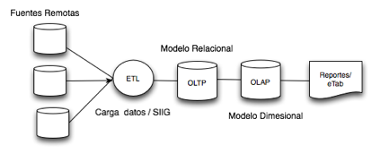

## Esquema logico del la Aplicación

El Tablero eTAB es un sistema que cauta como un servicio Web disponible para que dependencias del sistema de salud suban sus datos para poder analizarlos, generar gráficas y reportes. 

La aplicación cuenta con un modulo para efectuar la extracción,transformación y carga de datos (ETL) desde diferentes fuentes. Estos datos son agregados y almacenados en una base de datos relacional (OLTP). Los datos están organizados por catálogos de referencia e Indicadores medibles. Los usuarios del sistema pueden administrar estos indicadores y catálogos y todos sus tributos usando el las herramientas que brinda el sistema.
Para efectuar consultas en linea los datos son agregados dentro de tablas optimizadas para el análisis en linea (OLAP). 
Las tablas para análisis son actualizadas periódicamente usando procedimientos almacenados de PostgresSQL.  
La gestión de consultas a las tablas de análisis OLAP se realiza por medio de un servidor dedicado. 
La interacción entre el servidor OLAP y el resto de la aplicación se realiza por medio de consultas AJAX. 
El resultado de las consultas al servidor OLAP, es porcesado usando JQuery y graficado usando la libreria de gráficos D3.  

## Tecnologías utilizadas
Todo el software utilizado para creación del SIIG/eTAB son paquetes de software libre.
Estos incluyen:

* GitHub: Gestor de control de versiones de código fuente
* Apache: Servidor de paginas web
* PostgreSQL: Gestor de bases de Datos
* Symfony: Entorno de desarrollo para PHP
* PHP: Lenguaje de desarrollo de la Aplicación eTAB
* Python: Lenguaje de desarrollo del servidor OLAP
* Cubes: Servidor OLAP desarrollado en Python
* D3.js: Librería para la generación de gráficos
* JQuery: Lenguaje para interfaces de usuario
* RabbitMQ: Servidor de Mensajería
* EasyBook: Generador de documentos en formato PDF

### Gestor de base de datos
[PostgreSQL] (http://www.postgresql.org/)

Versión 9.2
Actualmente le sistema únicamente puede utilizar PostgreSQL por la siguiente razón: 
La aplicación debe proveer la capacidad de analizar datos para cualquier indicador. Cada indicador esta construido con varios datos y relacionados por una formula almacenada en el sistema.  Es posible crear una tabla por cada grupo de datos, con la limitante de que es necesario conocer el dato antes de guardarlo, lo cual no es sostenible a futuro. 

La base de datos necesita guardar datos sin conocer de antemano sus características.  Esto se logra usando un esquema de datos generico EAV (entidad-atributo-valor). El manejo de esquemas EAV es implementado de diferentes formas para diferentes gestores de bases de datos. El Tablero eTAB usa la implementación de Postgres la cual crea un tipo especial de dato llamado HSTORE. Además, el modulo de cubos OLAP utiliza la función CROSSTAB de Postgres para transponer grupos de datos.   El tipo de campo HSTORE y la función CROSSTAB no existen en otros gestores de bases de datos por lo cual no seria posible instalar esta aplicación usando un gestor de base de datos que no sea PostgreSQL. 

Para utilizar el tipo de datos HSTORE y la función CROSSTAB es necesario instalar el paquete contrib de postgresql y luego crear las extensiones correspondientes usando:

~#postgres> CREATE EXTENSION hstore ;

~#postgres> CREATE EXTENSION tablefunc ;

### Servidor Web
[Apache2] (http://www.apache.org)

Apache es un servidor Web de código abierto, se ha realizado sobre Apache versión 2.2

### Framework de desarrollo/Servidor
[PHP] (http://www.php.net)

[Symfony] (http://symfony.com/)

[GitHub] (https://github.com/)

El lenguaje que se ha utilizado es PHP 5.3.18 dentro de una estructura de desarrollo MVC manejada  Symfony versión 2.4
Cada mimbro del equipo de desarrollo usa un aplicativo diferente para escribir/modificar el código fuente. Los mas populares popular es Netbeans(version libre para PHP) y Nano. 
Para manejar cambios y mejoras al código fuente se uso Github. La totalidad  del código fuente esta disponible en https://github.com/erodriguez-minsal/SIIG
### Framework JavaScript
[jQuery](http://jquery.com/) versión 1.8.3 junto a [jQuery UI](http://jqueryui.com/)

### Framework para interfaces de usuario
[Bootstrap](http://twitter.github.com/bootstrap/)

Bootstrap es un framework que hace HTML, CSS y Javascript simple y flexible para componentes e interacciones de interfaz de usuarios populares.

### Librería para gráficos
[D3](http://d3js.org/) 

Antes conocida como Protovis, D3 es una biblioteca de JavaScript para manipular documentos basados en datos. D3 ayuda dar vida a los datos usando HTML, SVG y CSS. D3 enfatiza los estándares Web ofreciendo todas las capacidades de los navegadores modernos sin ligarse a una estructura propietaria.
A diferencia  de otras librerías, D3 no crea imágenes, sino que interactúa la pagina para crear los gráficos usando elementos de HTML5 como Canvas y SVG.

### Mensajería
[RabbitMQ](http://www.rabbitmq.com/)

La carga de datos se apoya de las librerías de este paquete para crear una ‘lista de espera’ para evitar que  el servidor se sature al recibir demasiadas peticiones simultaneas.  

### Servidor de Cubos OLAP
[Python OLAP Cubes](http://packages.python.org/cubes/)

El servidor de cubos OLAP es un proyecto de código abierto desarrollado usando Python 2.7, actualmente esta en la versión 0.10

### Documentación
La mayoría de la documentación ha sido escrita en formato markdown y se ha utilizado [easybook](http://easybook-project.org/) para la gen
